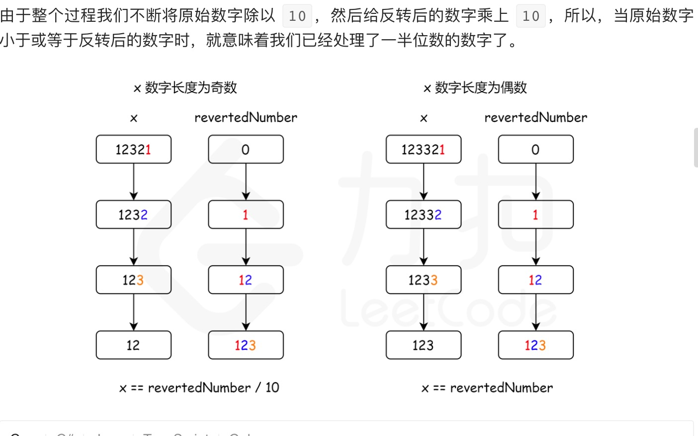

1. 数学方法

   

            pub fn is_palindrome_int(mut x: i32) -> bool {
                // x 为负数   -121   反转为121- 因为有符号，所以不可能相等
                // 除了 0 以外，所有个位是 0 的数字不可能是回文，因为最高位不等于 0
                if x < 0 || (x % 10 == 0 && x != 0) {
                    return false;
                }
                // 折半
                let mut num: i32 = 0;
                while x > num {
                    num = num * 10 + x % 10;
                    x = x / 10;
                }

                x == num / 10 || x == num
          }
    
    全部反转

             public boolean isPalindrome(x:i32) {
                if(x < 0)
                    return false;
                let cur = 0;
                let num = x; // copy 类型的，不会发生所有权移动
                while num != 0 {
                    cur = cur * 10 + num % 10;
                    num /= 10;
                }
                return cur == x;
            }

