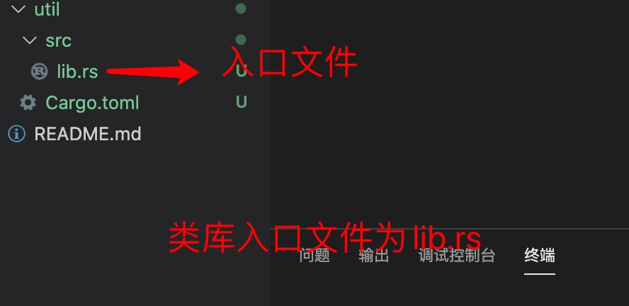

1. rust 项目分为两类，一类是可执行的二进制文件，一类是可供他人使用的类库

+ 可执行的二进制文件

        cargo new projectName(项目名称)

        cargo new projectName --bin  bin 可以省略，默认创建可以执行项目

+ 类库

        cargo new --lib libName(类库项目名称) 

2. 项目结构

    rust 两类项目结构几乎完全一致，只有跟入口不一样

   + 项目入口： src/main.rs
    

   + 类库入口 : src/lib.rs
    
    

3. 可执行项目，比如在main.rs 有且仅有一个入口方法，main 方法

        fn main(){

        }

        main 方法没有参数，也没有返回值

