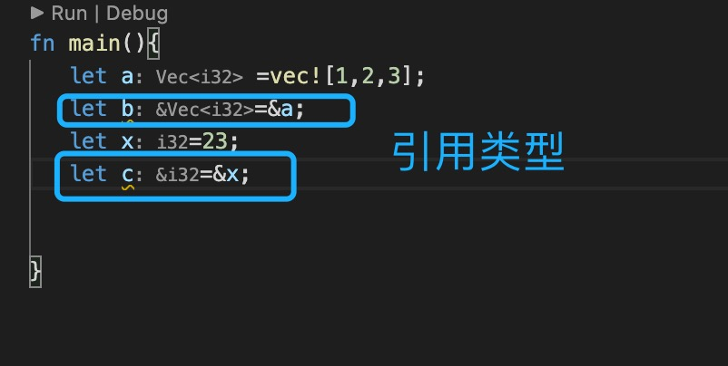
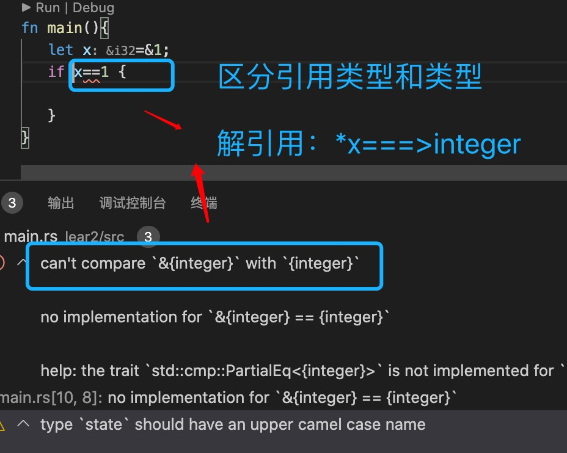
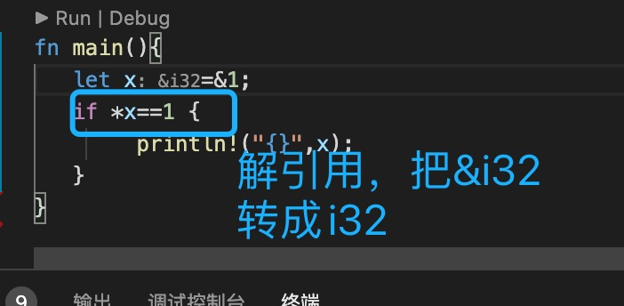

1. 引用类型 

   

   区分引用类型和非引用类型，是两种不同的类型。

2. 可变引用和不可变引用

+ 不可变引用 &T

        fn test(x:&String){ 
            println!("{:?}",x);
        }

+ 可变引用 &mut T

        fn test(x:&mut String){ 
            x.push_str("hello");
            println!("{:?}",x);
        }

3. 解引用

   
   