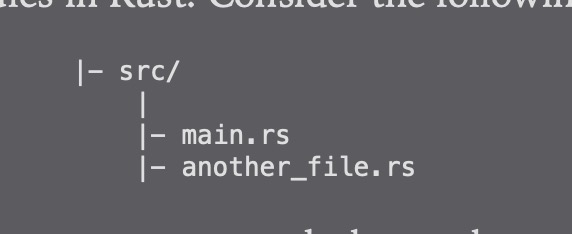
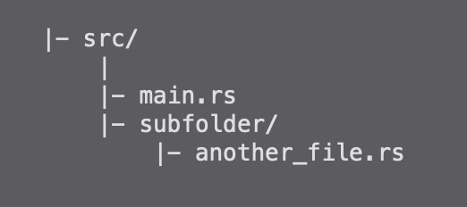

1. 文件作为模块

   项目目录结构：

   

   首先需要在 main.rs 中定义mod

        mod another_file;
        use another_file::map_learn; // 引用

        fn main(){
            map_learn();
        }

2. 文件夹

   项目目录结构：

   

   + 在subfloder 下面创建mod.rs

   + 在mod.rs 中定义模块

         mod another_file;
   + 在main.rs 中定义subfloader

         mod subfloader;

3. 引用模块

    最顶层目录crate

        use crate::map::{map_learn};

4. 模块中的定义

+ mod 定义模块

        pub mod test{
            pub struct Student{

            }

            pub fn learn(){

            }
        }

+ pub : public 的缩写，没有pub 默认为私有，不能被外部访问
