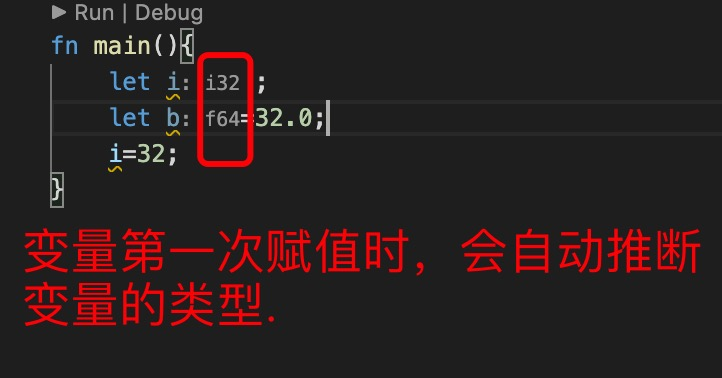
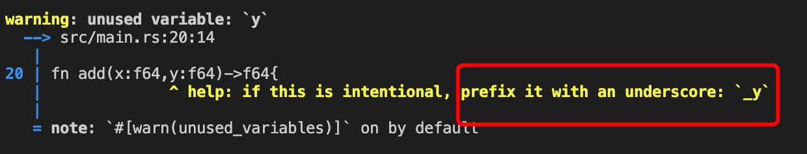
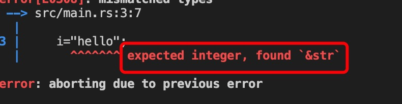
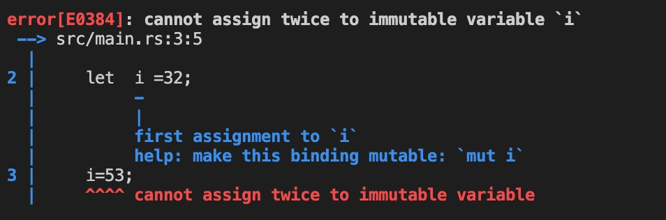
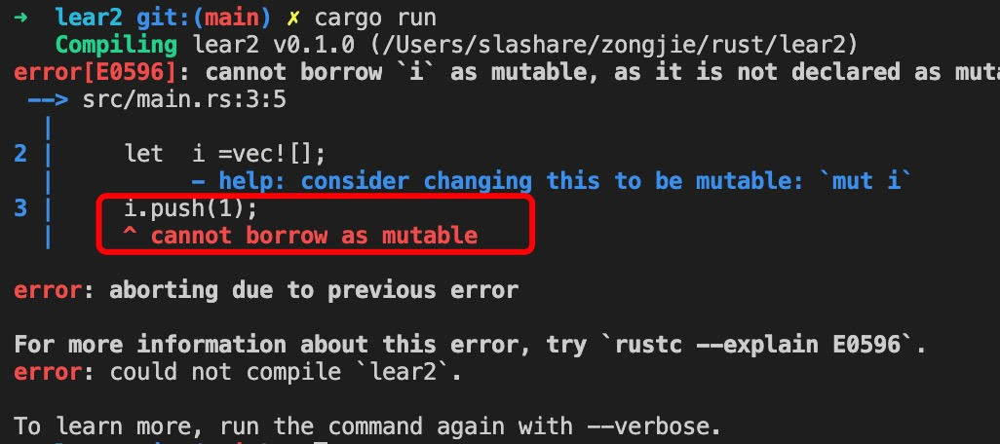
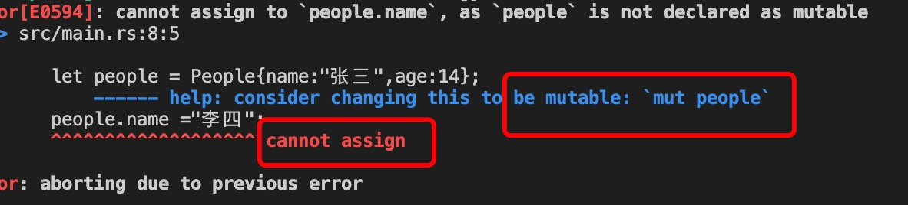

0. 在 rust 中变量必须先声明才能使用

        let name:Type = 3;

   rust 支持类型推断，可以省略 类型声明

        let  name =3 ;// 自动推断类型为i32

1. 变量名参数名等由下划线（_) 或字母为开头的数字，字母，下划线组成的

2. rust 遵循下划线命名规则，包括变量，参数，函数名称等，有下划线分割两个单词，比如：

        let goods_list :Vec<i32> =vec![];

        fn get_age(){
            12
        }

        fn set_age(age:i32){
            println!("{}",age);
        }

3. rust 对于声明了但未使用的变量，会报警告，可以使用下划线_ 开头，省去警告

   

4. rust 是静态强类型语言，类型确定以后不能再赋值不相同类型的值，比如：

        // 定义一个i32 类型的变量,

        let mut i =32;

        i="hello"; // 错误，类型已确定，只能是int32 类型的值
    
    

    期望是int 类型，发现确实&str 类型

5. rust 使用let 声明变量，const 声明编译时常量，static 声明静态变量

6. rust 中的变量和其他语言的变量不一样，rust 声明的变量分为***可变和不可变***

 > let 默认声明的变量是不可变的，即不能修改值，包括数组，结构等

        let i =32 ;// i 的值不能修改

        i=53;// 错误，不能给不可变的类型赋值两次

   

        let  i =vec![];
        i.push(1); // 错误，
   

        struct People{
            name:&'static str,
            age:i32
        }

        fn main(){
            let people = People{name:"张三",age:14};
            people.name ="李四";
        }
   

>  要想变量可变，需要声明 mut 

        let mut i =32;
        let mut arr:Vec<i32> =vec![];
        let mut people = People { name:"张三",age:14 };

        i=44; // 更改值

        arr.push(1);// 数组添加元素

        people.name = "李四";

7. const 常量，永远不能修改
