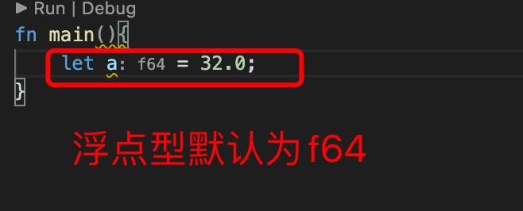
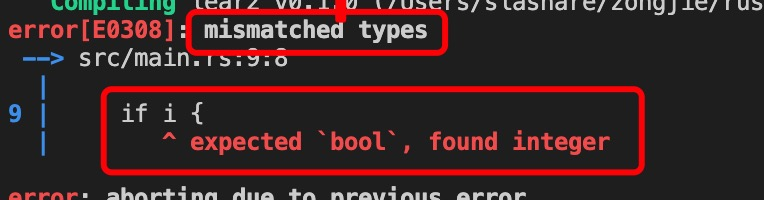
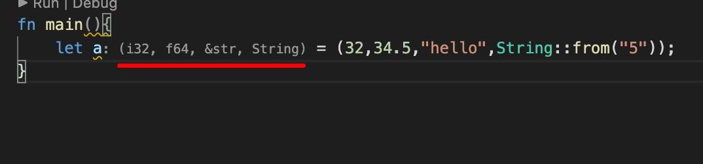
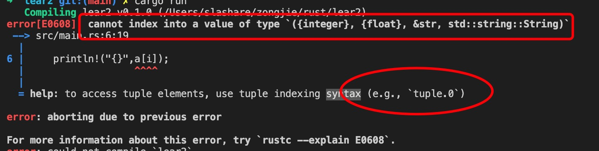
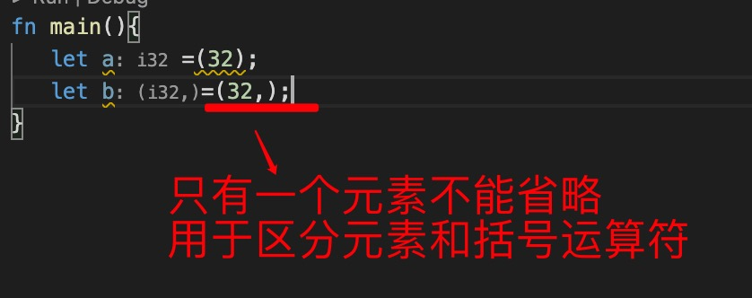
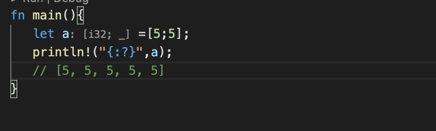
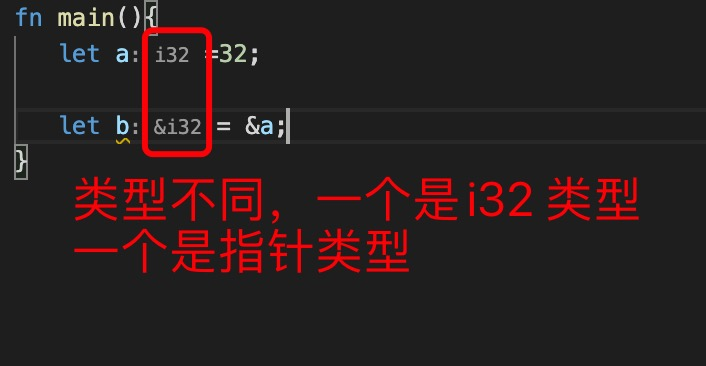

1. 在rust 中分为基础类型和复合类型

2. 基础类型

> 整型

   分为有符号（isize）和无符号(usize), 

   + 有符号： 即 + （正） - （负） 有正数和负数之分

        + i8 ：

        + i32: 32 为长度，声明变量时，如果数字类型没有明确声明，即类型推断时，默认为i32 类型

        + i64

        + isize

   + 无符号： 只有整数，没有负数， 比如 u8 范围为 0~257

        + u8 

        + u32

        + u64

        + usize

> 浮点数： 类似c/c++ 中的float 和 double

   + f32: 类似float, 单精度

   + f64: 类似double， 双精度, 默认类型

   

 **注意** 

 浮点数运算时由于计算机精度问题，会导致出现意外结果，比如

        print!("The sum is {}", 80.3 + 34.9);
        The run will print The sum is 115.19999999999999.

> char : 字符类型，使用单引号括起来，表示一个字符

        let a ='a';

> bool 类型，只有true 和 false 两个值

   在rust 中出于类型安全，并不会出现类型自动转换，因此在做条件判断（==，>,>=,<, <=, ||, &&, !) 时，必须明确返回true 和 false

    例如：

            let i =0；

            if i==0 {
                // 正确
            }

            if i {
                // 类型不匹配，期望是bool 类型，而这里是int 类型
            }

**注意**

在rust 中并没有类似JavaScript中隐式转换，比如 0，“”，等为false, rust 要求必须明确返回true 和 false;

+ bool 可以转换成int ,但是反过来不行

        let a = true as i32; // 1

        let b = false as i32;// 0

        fn main(){
            let a = true as i32;
            let b= false as i32;

            println!("{}",a);  // 1
            println!("{}",b);  // 0
        }

3. 复合类型 （tuple,数组)

> tuple ： 元素， 用() 括号表示，

+ 元组是可以有任意类型的集合，比如一个元组中可以有i32,f64,String 等类型，

   

+ 获取元组元素只能使用常量下标，不能使用变量

        fn main(){
            let a = (32,34.5,"hello",String::from("5"));
            println!("{}",a.0);
            let i =0;
            println!("{}",a[i]); // 错误
        }
   

+ ***当元组中只有一个元素时，逗号不可以省略，以区分() 括号运算符***

> 数组 [] 在rust 中数组不同于元素，是一组相同类型元素的集合

   数组长度是固定的，而且所有元素的类型是一样的。

        let i:[i32;5]=[1,2,3,4,5];

        [i32;5]
        i32: 数组元素类型

        5: 数组长度

   

        let a =[5;5]; 

        [5;5]
        第一个是用数字5填充元素

        第二个5 是数组的长度

> Vec<T> vec! 向量，又称为动态数组

> HashMap: python 中的字典，JavaScript中的对象

>() ： 基单元，没有返回值的函数返回基单元

> 指针 & 

> 枚举

> 结构 struct

> 范围类型 

+ 0..n : 0 到 n,不包含n

+ 0..=n: 0 到 n, 包含n

   