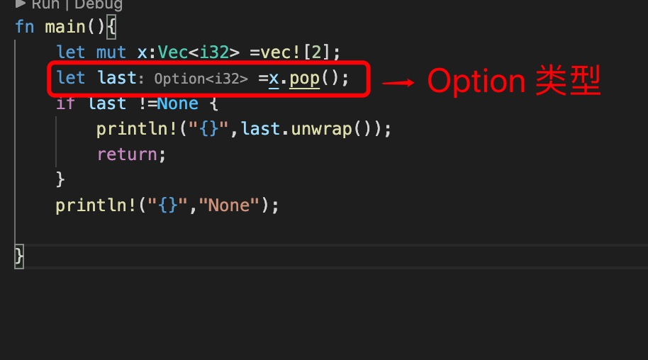
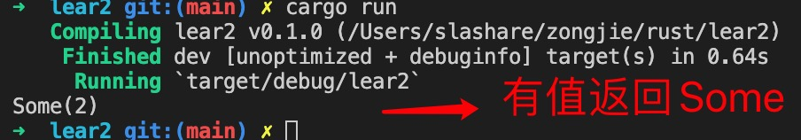
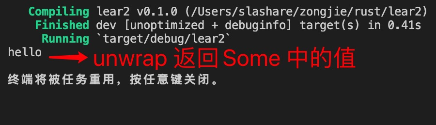

1. rust 为了防止没有校验为null的情况，设计了Option<T> 类型，

        Option<T> {
            Some(T),
            None
        }

2. 没有值返回None, 有值返回Some 类型

        fn main(){
            let mut x:Vec<i32> =vec![2];
            let last =x.pop(); // 返回Option, 向量为空返回None
            if last !=None {
                print!("{}",last;
                return;
            }
            print!("{}","None");

        }

3. unwrap() 返回Some 中的值

     println!("{}",Some("hello").unwrap());

