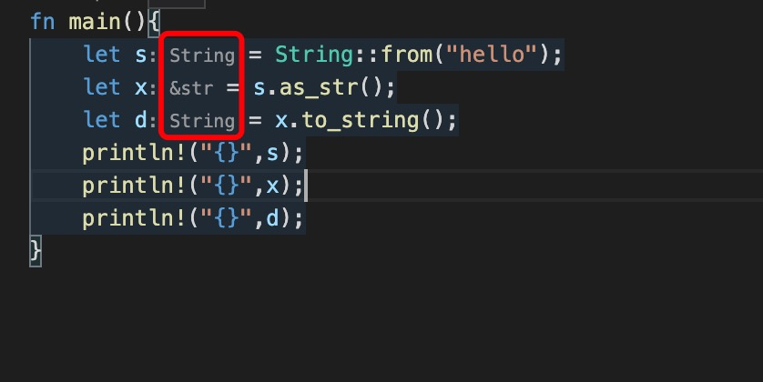

1. 在rust 中字符串使用双引号括起来，不能向python 和 JavaScript一样使用单引号，在rust 中***单引号表示字符***。

2. 和其他语言不一样，字符串分为字符串字面量(&str) 和 字符串对象(String)

3. 字符串字面量

        let a :&str ="hello";

> &str 用于类型定义，但是当用作函数返回值类型或者结构体中字段类型式，使用&'static str;

        fn get_name()->&'static str{
            "hello"
        }

        struct People{
            name:&'static str,
        }

4. 字符串常用方法

+ len() : 获取字节长度

 一个中文占有三个字节

        println("{}","中国".len());//6

+ chars(): 返回Chars 类型

        let a ="abcde".chars();

        获取长度

        chars.count();

         let a="ab中国cde".chars().count();
         println!("{}",a); //7

+ split(flag &str): 分割字符串

   rust 中分割字符串类型为Split

        let a:Vec<&str>="ab中国cde".split("").collect();
        ["", "a", "b", "中", "国", "c", "d", "e", ""]

        let b:String=a.join(""); //"ab中国cde"

        let b:String = a.concat();

+ to_string(): 把&str 转换为String

+ as_str() ： 把String 转成&str

5. 字符串切片返回&str

        v[start..stop] -> &str

        要想返回String 类型

        v.to_string()