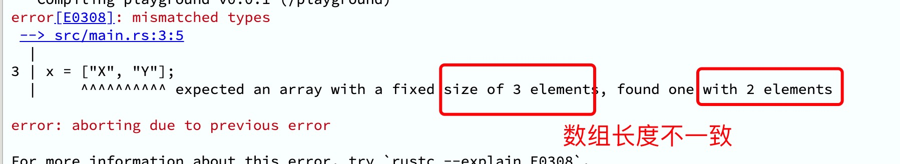
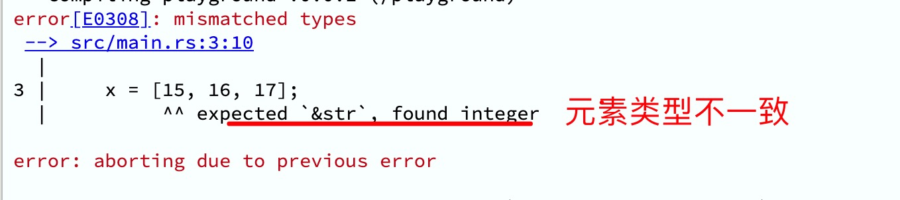
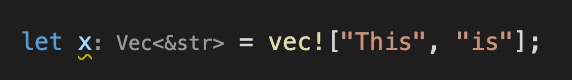
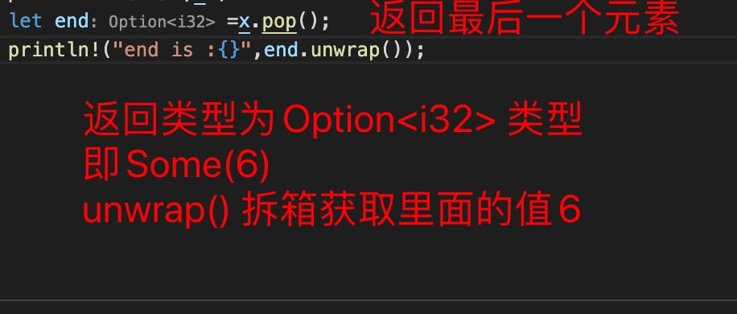

1. 在rust 中数组是一些相同元素的的集合，而且编译时长度已定义好。

        let a = [1,2,3,4,5]; // i32 类型，长度为5

2. 获取数组中元素，下标从0 到 len()-1

        let a =[1,2,3,4,5];
        let index =2;
        println!("{}",a[index]);

3. 数组方法

   + len() ： 长度

        let a = [true, false];
        let b = [1, 2, 3, 4, 5];
        print!("{}, {}.", a.len(), b.len());

   + 修改值

        let mut b = [1, 2, 3, 4, 5];
        b[0]=10;
        println!("{:?}",b);

> ***在rust 中数组的长度是固定的，可以修改每个元素的值，但是不能修改数组的长度，因此也就没有添加元素***

        fn main() {
            let mut x = ["a", "b", "c"]; // x 类型为 [&str;_]

            x = ["X", "Y"];  // 错误， 数组长度为三，这里是两个元素

            x = [15, 16, 17];// 错误，元素类型不一致，x 中元素为字符串类型
        }

   
   

4. Vec<T> vec! 向量： 动态数组，可以动态更改数组中的内容，包括添加，修改，删除等

> 定义变量

        let x = vec!["This", "is"];
    

        let a=[1,2,3,4,5];

        let x = Vec::from(a);

        let c:Vec<i32>=Vec::new(); // 必须带有类型

5. vec 向量中常用的方法

+ len() : 元素个数

        // 元素个数
       println!("{:?}",a.len());

+ is_empty(): 是否为空，空([])返回 true, 不为空([1,2,3])返回false

        let y:Vec<i32> = Vec::new();// [] 空

        let x=vec![1,2,3];

        println!("{}",y.is_empty());// true

        println!("{}",x.is_empty());// flase

+ push(element): 在末尾追加元素

         x.push(6);
         println!("{:?}",x);

+ insert(index,element): 插入元素

   index: 下标位置
   element: 要插入的元素

        x.insert(1, 10);  // 
        println!("{:?}",x);

+ iter(): 遍历,数组中的元素不可以修改

        for n in x.iter() {
            println!("{}",n); // 数组中的元素不可以修改
        }

+ iter_mut(): 数组中的元素可以修改

        for n in x.iter_mut() {
            println!("{}",n); // 数组中的元素不可以修改
        }

+ pop(): 移除数组中的最后一个值，并返回移除的元素

        let mut x =[1,2,3,4,5,6];
         let end:Option<i32> =x.pop(); // 返回一个Option: Some(6)
        println!("end is :{}",end.unwrap()); // 拆箱返回6
        println!("{:?}",x);  // 移除最后一个元素 [1,2,3,4,5]

   

+ reverse() : 反转数组元素

        let a =[1,3,6,5];
        x.reverse(); // 反转
        println!("{:?}",x); // [5,6,3,1]

+ sort() : 排序

        let a =[1,3,6,5];
        x.sort(); // 排序
        println!("{:?}",x); // [1,3,5,6]

+ remove(index): 移除下标对应的元素，并返回该元素

         // 移除
        let d =x.remove(2);
        println!("{}",d);
        println!("{:?}",x);

+ to_vec(): 数组类型转vec![] 类型

6. 数组切片

         // 数组切片
         println!("{:?}",&x[0..3]);  // 这里使用&,因为切片只能使用引用

7. vec! 只能创建值，不能当做值，因为需要指定类型，因此只能使用Vec<T>

        fn show_len(arr:Vec<i32>)->usize{
          arr.len()
        }