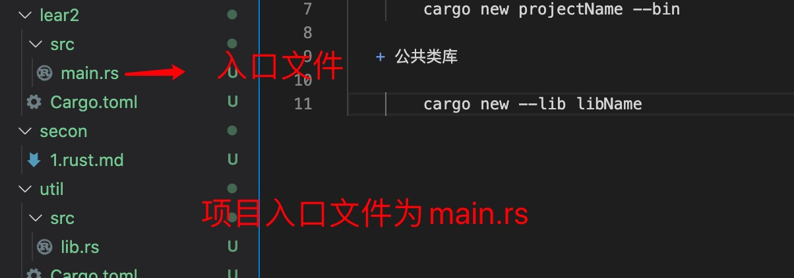
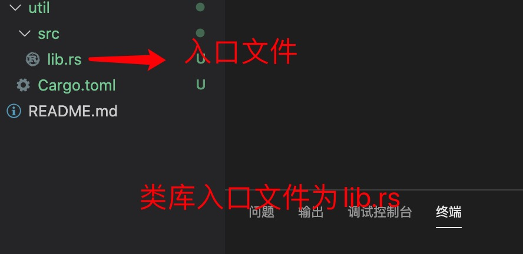

1. 创建项目

   + 可执行的二进制文件

        cargo new projectName

        cargo new projectName --bin
    
    

    > 在应用程序main.rs 入口文件中必须有一个main 方法，作为启动项目，

    一个应用程序必须有且仅只有一个main 方法，作为入口文件，

    因此类库文件中不能有main 方法作为入口函数

   + 公共类库

        cargo new --lib libName 
    
    

2. crate 最为应用程序或者包，可用作根目录