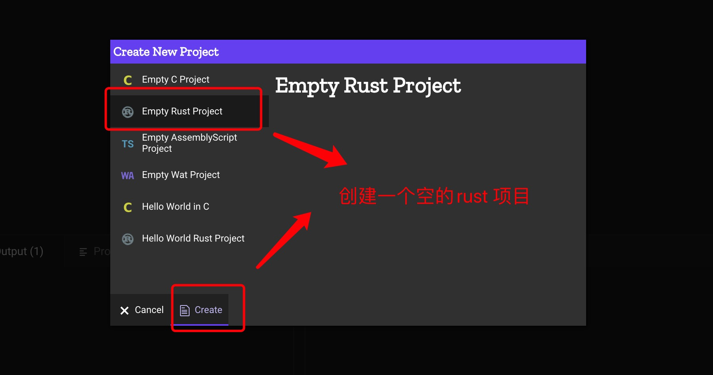

1. WebAssembly 是基于堆栈的虚拟机二进制指令格式可被移植的用于不同的os。

   wasm 是webAsdembly 的缩写。

2. WebAssembly 不是一种新的语言，他是由高级语言，比如c++,rust,go 等编译而成的。

   webAssembly 需要一个宿主机，比如浏览器或者控制台应用程序（node.js）

3. 在线编辑器  https://webassembly.studio/

   
   
   
   build & run : 编译和执行
   

4. 执行WebAssembly的某些方面需要一些命名约定

5. Wasm模块永远无法访问主机的任何内存