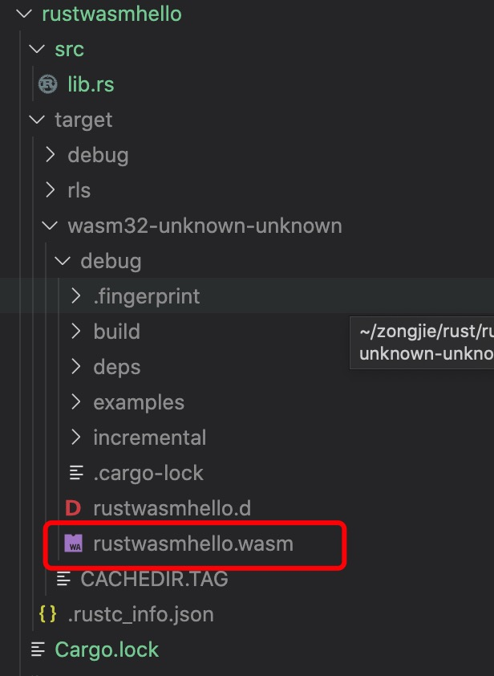

1. webAssembly 是一个类库

   因此可以使用cargo 创建一个webAssembly

        cargo new --lib rustwasmhello

2. Cargo.toml 

        [lib]
        crate-type = ["cdylib"] //该项目将公开一个C样式的动态库的指示符

3. 修改src/lib.rs

        #[no_mangle]
        pub extern "C" fn add_one(x: i32) -> i32 {
            x + 1
        }

4. 生成

        cargo build --target wasm32-unknown-unknown

   