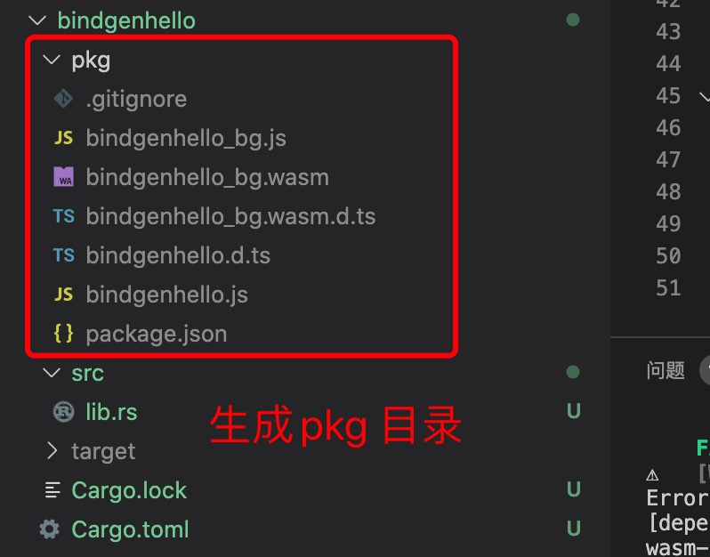

1. wasm-bindgen 是rust 和 JavaScript 中桥梁

        cargo​​ ​​install​​ ​​wasm-bindgen-cli​

2. 创建一个基于bindgen 的项目

       
        cargo new bindgenhello --lib

        该--lib标志指定该项目是一个库，这很重要，因为我们将从JavaScript调用此代码

3. 修改lib 类型

        [lib]
        crate-type = ["cdylib", "rlib"]
   Rustwasm板条箱与普通板条箱略有不同，因此，我们需要在Cargo.toml。

   [lib]通常，在Cargo项目中不需要此注释，并且如果您熟悉其他Rust板条箱，您会记得最常见的板条箱类型是rlib（默认）或bin二进制文件（不需要crate-type 注释）。

   尽管这里crate-type = ["cdylib"]通常表示您希望编译器创建动态系统库，但是对于WebAssembly目标，它只是表示“创建*.wasm不带start函数的文件”。在其他平台上，此输出类型将*.so在Linux，*.dylibmacOS和*.dllWindows上创建文件。

   我们还指定crate-type = ["rlib"]要确保可以使用我们的库进行单元测试wasm-pack test（我们将在后面介绍）。否则，我们将无法测试我们的库，因为cdylib板条箱类型与wasm-pack单元测试的样式不兼容 。

                [lib] //其库类型更改为cdylib
                crate-type = ["cdylib"]
        
        添加一个[lib]部分，将新字段crate-type设置为 "cdylib"。这指定该库是C兼容的动态库，cargo当目标是时，它有助于将正确的标志传递给Rust编译器 wasm32

4. 添加wasm-bindgen 依赖

        [dependencies]
        wasm-bindgen="0.2.69"

5. 在lib.rs 中引用wasm-bindgen

        extern crate wasm_bindgen;// - 要替换成_(下划线)

        use wasm_bindgen::prelude::*;

6. hello 

        extern crate wasm_bindgen;

        use wasm_bindgen::prelude::*;

        #[wasm_bindgen] // 要与JavaScript交换需要加上wasm_bindgen 声明
        // extern 表示导入JavaScript函数名
        extern "C"{
            // 调用JavaScript的alert方法
            fn alert(s:&str);
        }

        #[wasm_bindgen]
        // rust 导出函数给JavaScript调用
        pub fn greet(name:&str){
            alert(&format!("hello,{}!",name));
        }

7. 生成

        cargo​​ ​​build​​ ​​--target​​ ​​wasm32-unknown-unknown

        或者使用wasm-pack 打包
        wasm-pack build

   

8. 生成的js

        bindgenhello_bg.js

        import * as wasm from './bindgenhello_bg.wasm'; // 从wasm 文件导入

        /**
        * @param {string} name
        */
        export function greet(name) {
            var ptr0 = passStringToWasm0(name, wasm.__wbindgen_malloc, wasm.__wbindgen_realloc);
            var len0 = WASM_VECTOR_LEN;
            // 调用wasm 中定义的greet 方法
            wasm.greet(ptr0, len0);
        }

9. 导入js 函数

           #​[wasm_bindgen]
        ​ 	​extern​ ​"C"​ {
               // 导入alert 函数
        ​ 	    ​fn​ ​alert​(s: &str);
        ​ 	
        ​ 	    #[wasm_bindgen(js_namespace = console)]
        ​ 	    ​fn​ ​log​(s: &str);
               // 导入console.log
        ​ 	
        ​ 	    #[wasm_bindgen(module = ​"./index"​)]
        ​ 	    ​fn​ ​stats_updated​(stats: JsValue);
        ​ 	
        ​ 	    ​pub​ ​type​ Display;
               // Rot.js在ROT名称空间中包含一个名为Display的类。通过在extern块内声明Display类型，wasm-bindgen使该类型可用于您的代码，并生成与其通信所需的一切。请注意，我们没有在Display类型上放置名称空间限定符，仅在函数上放置了名称空间限定符。 wasm-bindgen从这些函数构建类型，这些函数确实具有名称空间限定符​ 	

                // 下面两个是js 方法重载
        ​ 	    #[wasm_bindgen(method, structural, js_namespace = ROT)]
        ​ 	    ​fn​ ​draw​(this: &Display, x: i32, y: i32, ch: &str);
        ​ 	
        ​ 	    #[wasm_bindgen(method, structural, js_name = draw, js_namespace = ROT)]
        ​ 	    ​fn​ ​draw_color​(this: &Display, x: i32, y: i32, ch: &str, color: &str);
        ​ 	}

10. 导出结构

        #​[wasm_bindgen]
        ​ 	​pub​ ​struct​ Engine {
        ​ 	    display: Display,
        ​ 	    points: HashMap<GridPoint, String>,
        ​ 	    prize_location: Option<GridPoint>,
        ​ 	}
