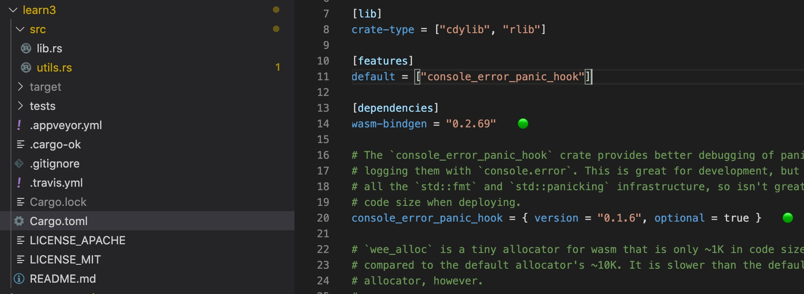
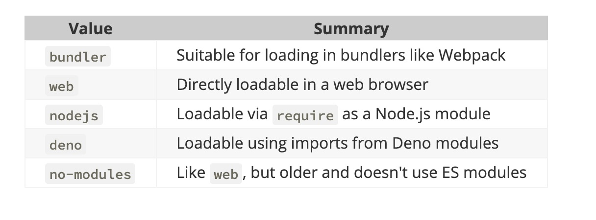

参考文档：https://rustwasm.github.io/docs/wasm-pack/commands/pack-and-publish.html

1. wasm-pack 创建，打包和发布项目

2. 创建 new

+ 名称

        wasm-pack new <projectName>

        wasm-pack new learn3

   

+ 模板 --template

        wasm-pack new myproject --template https://github.com/rustwasm/wasm-pack-template

+ 模式

        wasm-pack new myproject --mode noinstall

        + normal: 正常,默认模式
        + noinstall:wasm-pack不应尝试安装任何基础工具。如果找不到必要的工具，该命令将出错
        + force:wasm-pack不应检查本地Rust版本。如果本地Rust是不可接受的Rust版本，该命令将出错

3. 打包build

        wasm-pack build

        // 生成文件名
        wasm-pack build --out-name index
        # will produce files
        # index.d.ts  index.js  index_bg.d.ts  index_bg.wasm  package.json  README.md
    
+ target

   该build命令接受一个--target参数。这将自定义发出的JS，以及如何实例化和加载WebAssembly文件。

        wasm-pack build --target nodejs

   

4. 发布打包

+ pack

        wasm-pack pack myproject/pkg

+ publish

        wasm-pack publish --tag next