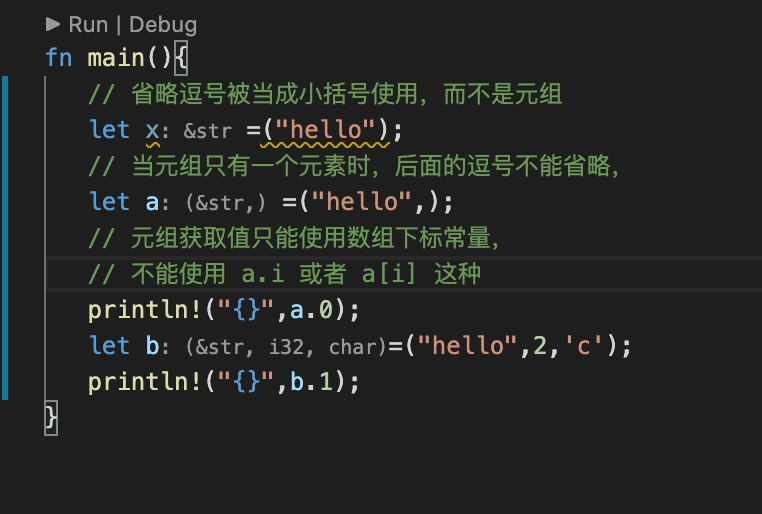

1. tuple 元组使用（） 标记，

        let a =("hello",4);
2. tuple 类型设置

   

3. 元组与数组的区别

+ 元素和数组都是集合

+ 元素中每个元素可以是任意类型，但是数组是相同类型元素的集合，即数组中每个元素必须拥有拥有相同的类型。

+ 元组只允许常量作为索引，例如t.4。您不能写t.i或t [i]来获得第i个元素

4. 元组常被用来返回多个值

        fn split_at(&self, mid: usize) -> (&str, &str);