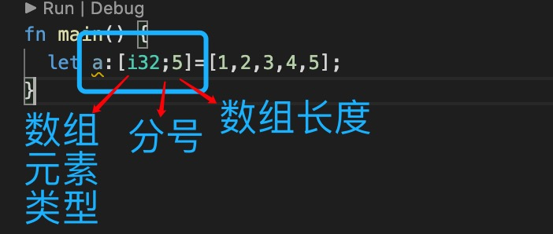
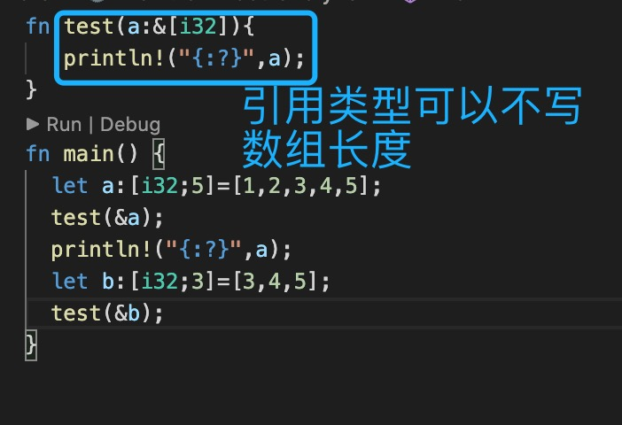
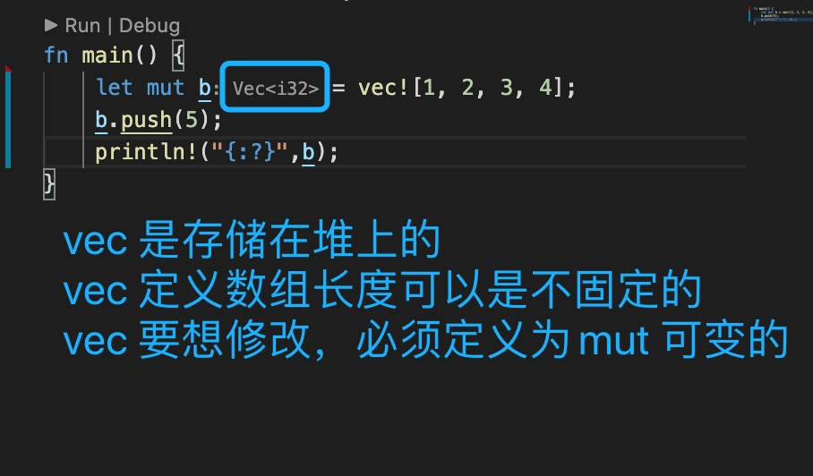
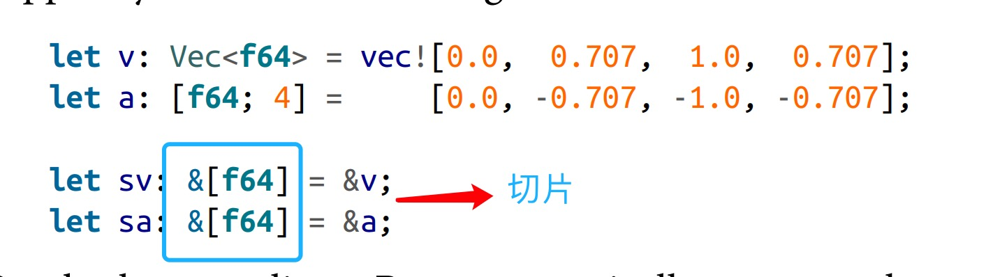
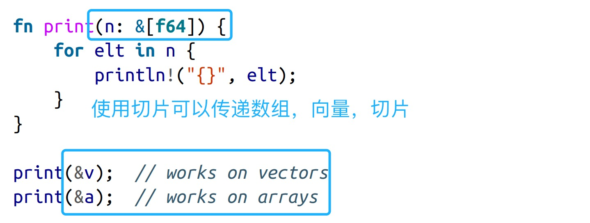
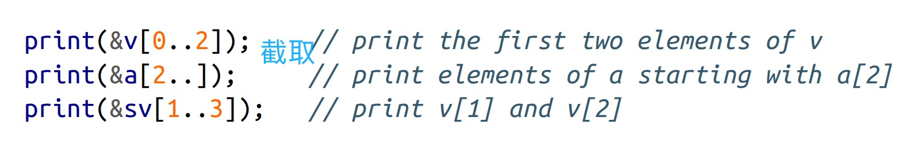

1. rust 中有三种方法表示值序列.

+ 数组[]

   数组是一组***相同类型***的元素集合，即每个元素拥有相同的类型
   比如： 如果定义一个i32 类型的集合，那么这个数组中的每一个元素都必须是i32 类型的。

   

   ***数组长度是固定的，不能追加或者缩小数组***

   里面的项可以修改，但是数组长度在编译期就确定了，不能修改

        let mut a =[1,2,3,4];
        a[1]=10;
        println!("{:?}",a);

> 数组长度是固定的，但是当我们在定义公共方法时，传入的数组大小可能是不固定的，可以使用&（引用类型的）

   &[i32]: 切片类型

   

+ 向量Vec: Vec<T>

   向量是动态的数组，可以动态添加元素，删减元素，
   

+ slice: 切片

   
   
   

2. 循环

           let mut b = vec!["a", "b", "c", "d"];
            b.push("e");
       

            for i in 0..b.len(){ // i 为索引
                let tmp =b[i];
                println!("{}",tmp);
            }
            for item in b.iter(){  // item 为每个元素
                 println!("{}",item);
            }

            for i in b.iter_mut(){  // 可修改
                let mut x =i.to_string();
                x.push_str("1");
            }
            println!("{:?}",b);

3. for in

            // for in b 会发生move 移动
            for item in b { // item 为具体元素
               println!("{:?}",item); 
            }
            println!("{}",b);// 错误，已经移动