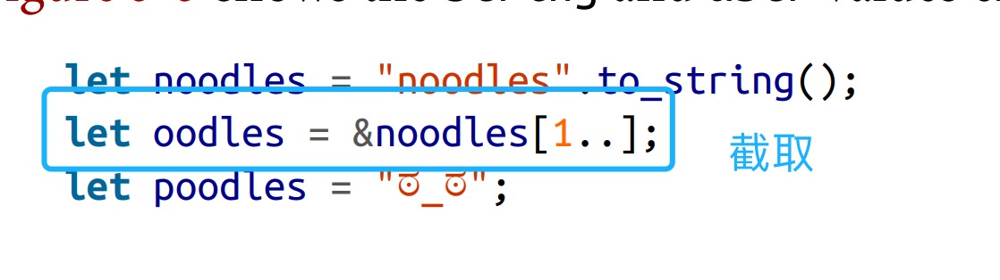
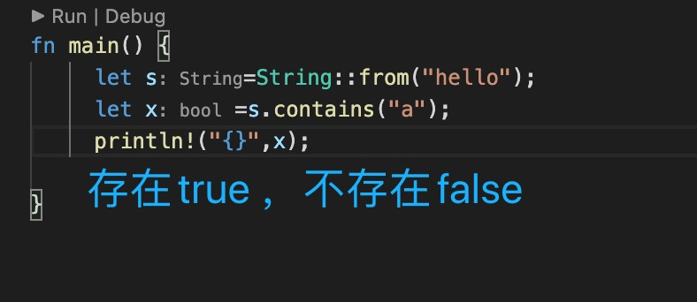
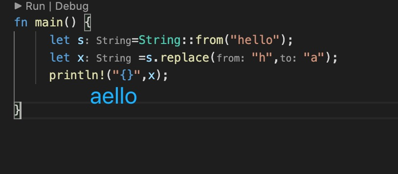
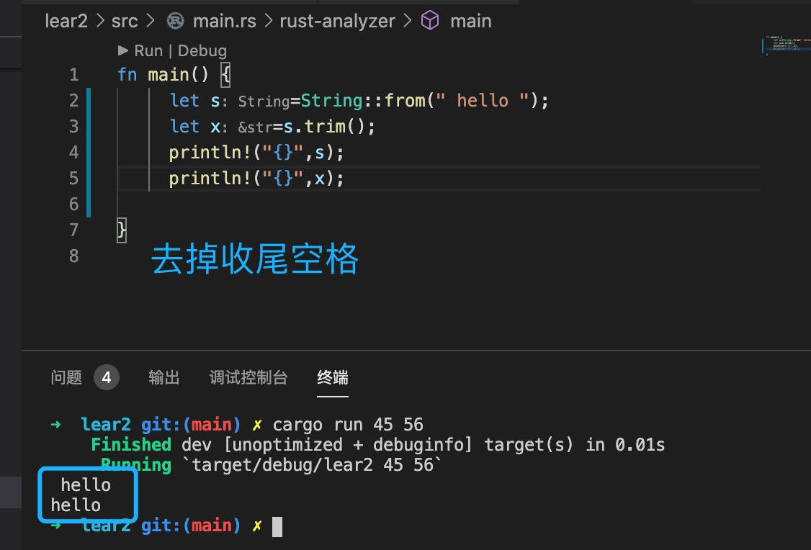
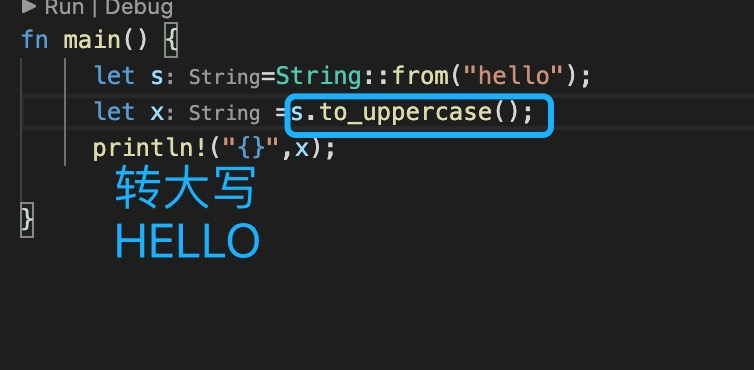
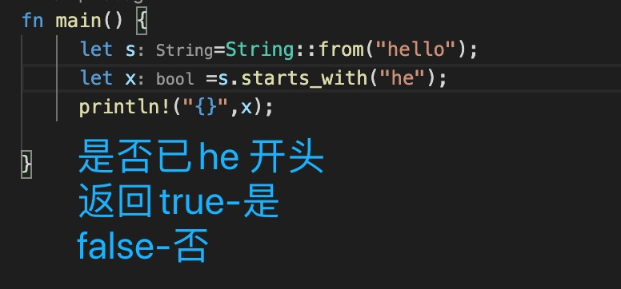
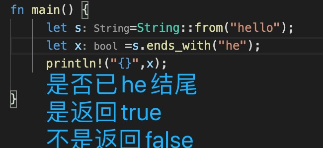
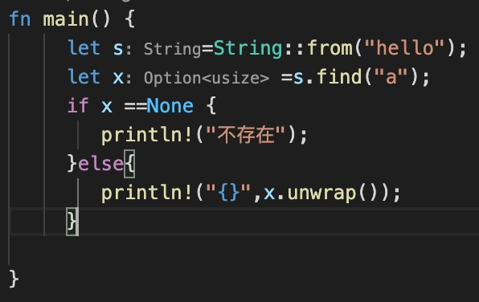

1. 在rust 中分为字符串和字符，字符串使用***双引号***括起来

2. 字符串分为字符串字面量和字符串对象

        let a:&str ="hello";

        let b:String = String::from(a);

3. 截取字符串使用slice

   

4. r 不转义字符床，输出原始字符串， \ 转义字符串

5. 常用方法

+ to_string() : 把&str 类型转为String

+ format! ： 格式化

        format!("{}°{:02}′{:02}″N", 24, 5, 23),"24°05′23″N".to_string()

+ concat  和 join 

        let bits=vec!["veni","vidi","vici"];
        bits.concat(); "venividivici"
        bits.join(",");//"veni,vidi,vici"

+ contains: 包含字符串

        "peanut".contains("nut")

   

+ replace: 替换

        "sssabbb".replace("a","c");
   

+ trim: 去掉两边空格

   

+ to_lowercase() ： 转小写

+ to_uppercase(): 转大写

   

+ starts_with(): 已 ...开始

        word.starts_with("v")

   

+ ends_with(): 已 。。。结尾

   

+ find("hello"): 是否存在，返回Option 类型

   