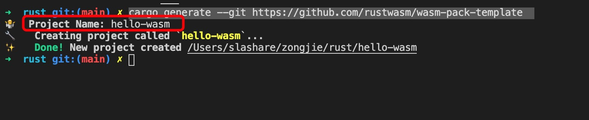
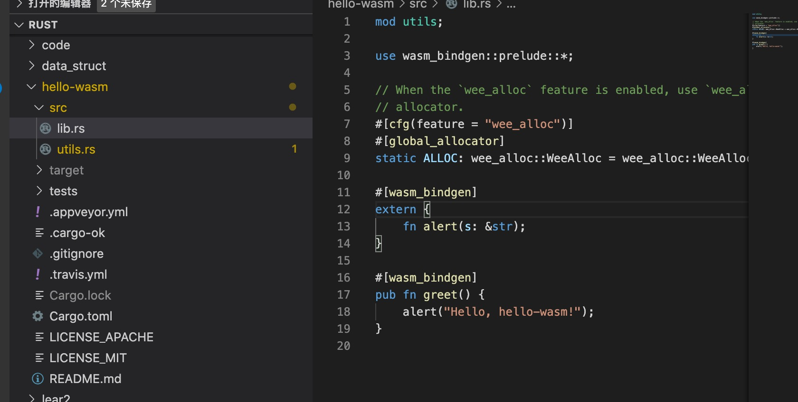
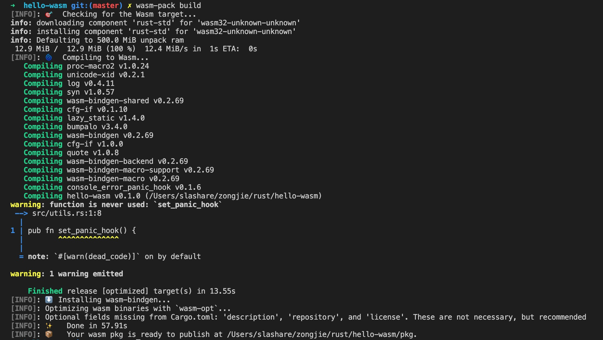

1. 使用cargo generate

            cargo generate --git https://github.com/rustwasm/wasm-pack-template

    会提示输入项目名称，然后创建醒目

    

    生成的项目目录结构

    

2. 该src/lib.rs文件是我们正在编译为WebAssembly的Rust板条箱的根。它用于wasm-bindgen与JavaScript交互。它导入 window.alertJavaScript函数，并导出greetRust函数，该函数将警告消息

   wasm_bindgen 用于和js 交互

        #[wasm_bindgen]
        extern { // extern 导入js 函数
            fn alert(s: &str); // 导入js 的alert 函数
        }

        #[wasm_bindgen]
        pub fn greet() { // 导出greet 函数，供js调用
            alert("Hello, hello-wasm!");
        }

3. 使用wasm-pack 打包rust 项目

        wasm-pack build

   

        

