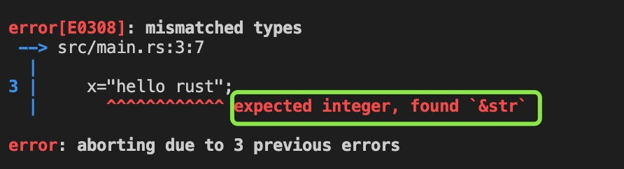
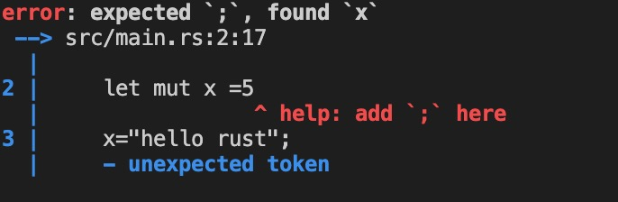

1. 后缀名

   rust 后缀名为rs

2. 程序入口main 函数

        fn main(){

        }

3. ! 感叹号

   rust ! 方法来调用宏即可，而不是普通函数,例如

         println!("Hello, world!");

4. rust 语句必须以;(分号) 结尾

5. 注释 // 

         // 这是第一种注释方式

         /* 这是第二种注释方式 */

         /*
         * 多行注释
         * 多行注释
         * 多行注释
         */

         /// Adds one to the number given.
         ///
         /// # Examples
         ///
         /// ```
         /// let x = add(1, 2);
         ///
         /// ```

6. rust 是强类型的语言，一旦类型确定，就不能再赋值其他类型的值，比如如果一个变量时数字类型，就不能再赋值字符串类型给该变量


        fn main() {
            let mut x =5; // 数字类型
            x="hello rust"; // 字符串类型
            println!(x);
        }
        

7. rust 语句分号不可以省略

   

8. rust 遵循下划线命名规则，比如js 中的toString()方法，在rust 中使用to_string()

   