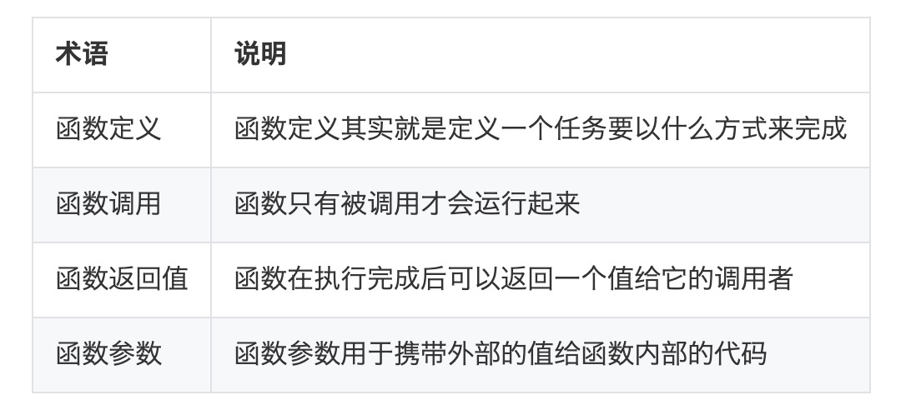
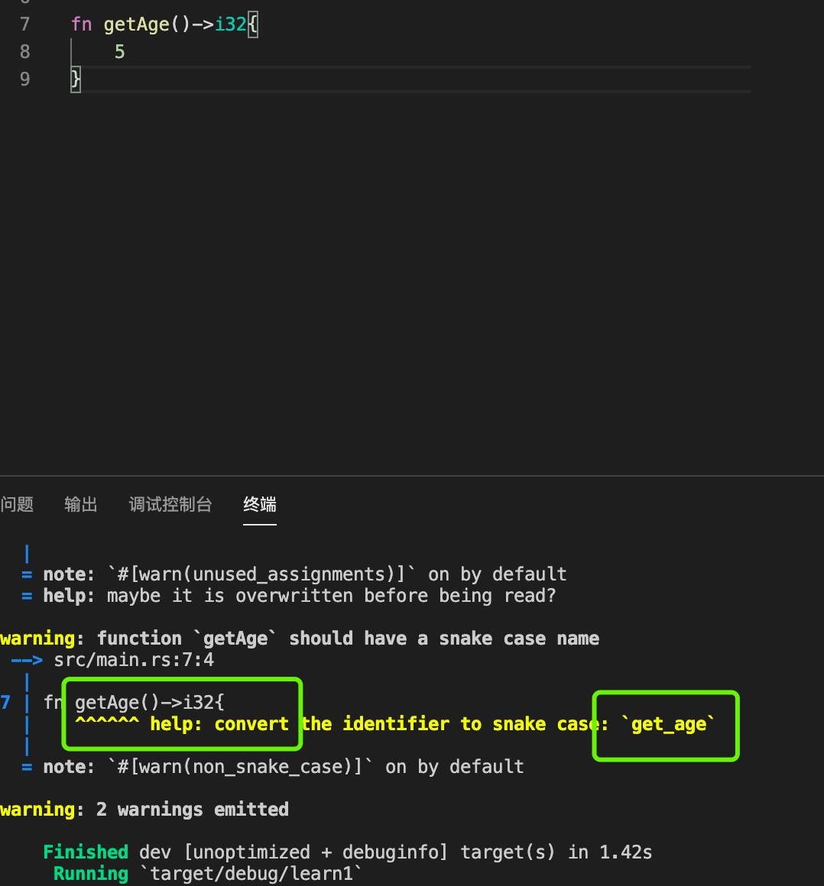
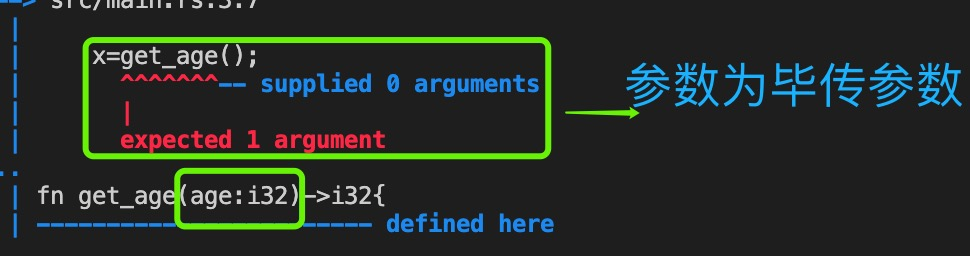

0. 程序入口函数 main

   >每个 Rust 程序都至少有一个函数，即主函数 main()。

        fn main(){

        }
   

1. 函数

   > 函数定义格式

        fn <函数名> ( <参数> ) {<函数体>}

   定义函数时***必须以 fn 关键字开头***，fn 关键字是 function 的缩写

   函数体 使用或括号({}) 包裹

   > 函数调用

   为了运行一个函数首先必须调用它。

   函数需要调用才会被执行

   让函数运行起来的过程我们称之为 函数调用

   ***如果函数定义了参数，那么在 函数调用 时必须传递指定类型的参数***

2. Rust 函数名称的命名风格是小写字母以下划线分割

        fn another_function() {
            println!("Hello, runoob!");
        }

   

3. 函数参数

**Rust 中定义函数如果需要具备参数***必须声明参数名称和类型***：**

        fn another_function(x: i32, y: i32) {
            println!("x 的值为 : {}", x);
            println!("y 的值为 : {}", y);
        }

   调用时，参数为必传，实参类型和形参类型一致

   

4. 函数体({})的语句和表达式

5. 返回值

   > 函数返回值定义

        function function_name() -> return_type {
                // 其它代码

                // 返回一个值
                return value;
        }

   > 没有return 

   如果函数代码中没有使用 return 关键字，那么***函数会默认使用最后一条语句的执行结果作为返回值***。

   函数中最后用于返回值的语句不能有 分号 ; 结尾，否则就不会时返回值了。

        function function_name() -> return_type {
                // 其它代码

                value // 没有分号则表示返回值
        }

   >如果没有明确声明函数返回值的类型，函数将被认为是"纯过程"，不允许产生返回值，return 后面不能有返回值表达式

   箭头（->）后声明了它们的类型。在Rust中，函数的返回值与函数主体块中最终表达式的值同义。您可以通过使用***return关键字并指定一个值从函数中提前返回***，但是大多数函数***隐式返回最后一个表达式***：

        fn get_age()->i32{
          return 6;
        }

        fn get_age()->i32{
                6// 隐式返回最后一个表达式
        }

        上面两个函数效果一样

6. 函数参数

> 参数

   + 形参：我们把函数定义时指定的参数名叫做 形参。
   + 实参：把调用函数时传递给函数的变量/值叫做 实参。

> 调用函数

   除非特别指定，函数调用时传递的 实参 ***数量和类型***必须与 形参 数量和类型必须相同

7. 传值调用和引用调用

  > 传值调用

  传值调用 就是简单的把传递的变量的值传递给函数的 形参，从某些方面说了，就是把函数参数也赋值为传递的值。

  因为是赋值，所以函数参数和传递的变量其实是各自保存了相同的值，互不影响。因此函数内部修改函数参数的值并不会影响外部变量的值。

  > 引用

  值传递变量导致重新创建一个变量。但引用传递则不会，引用传递把当前变量的内存位置传递给函数

  对于引用传递来说，传递的变量和函数参数都共同指向了同一个内存位置。

  ***引用传递需要函数定义时在参数类型的前面加上 & （类似c的指针）符号***

        fn function_name(parameter: &data_type) {
          // 函数的具体代码
        }

        fn main() {
                let mut no:i32 = 5;
                mutate_no_to_zero(&mut no);
                println!("The value of no is:{}",no);
        }
        fn mutate_no_to_zero(param_no:&mut i32){
                 *param_no = 0; //解引用操作
        }

   星号（  * ） 用于访问变量 param_no 指向的内存位置上存储的变量的值。这种操作也称为 解引用。 因此 星号（*） 也称为 解引用操作符

> 在rust 中无论基础数据类型和复合数据类型都有两种传参方式，一种就是值传递（包括数组) 赋值一个副本给参数，里面的改变不影响原变量，另外一种就是&(引用) 传值，无论基础类型还是复合类型都会根据里面的改变而改变

> 引用类型传值，默认是不能修改的，要想修改***必须使用&mut 定义***

