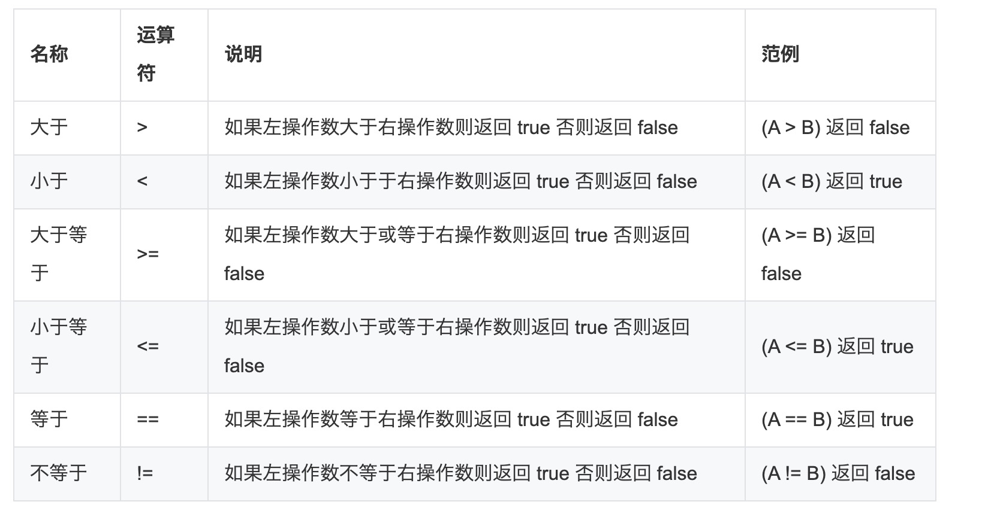
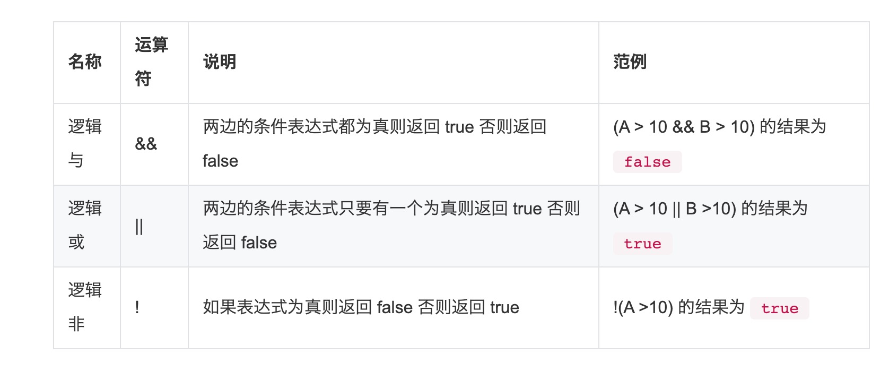

1. 算数运算符

+ 加 +

        let x=1;
        let y=3;
        let z = x + y; // 4

+ 减 -

        let x=1;
        let y=3;
        let z = y-x; // 2

+ 乘 *

        let x=1;
        let y=3;
        let z = x * y; // 3

+ 除 /

        let x=1;
        let y=3;
        let z = y/x; // 3

+ 求余 %

        let x=1;
        let y=3;
        let z = y%x; // 0

   > rust 暂时不支持++（自加） --（自减）

+  加等 +=

+ 减等  -=

+ 除等  /=

+ 乘等  *=

2. 关系运算符

   关系运算符用于比较两个或多个值之间的关系，是大于，是等于还是小于。

   >关系运算符的返回结果为 布尔类型。

   

3. 逻辑运算符

    逻辑运算符用于**组合**两个或多个条件。

    >逻辑运算符的返回结果也是布尔类型。

    