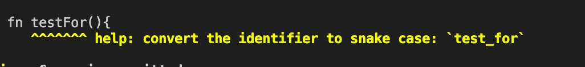
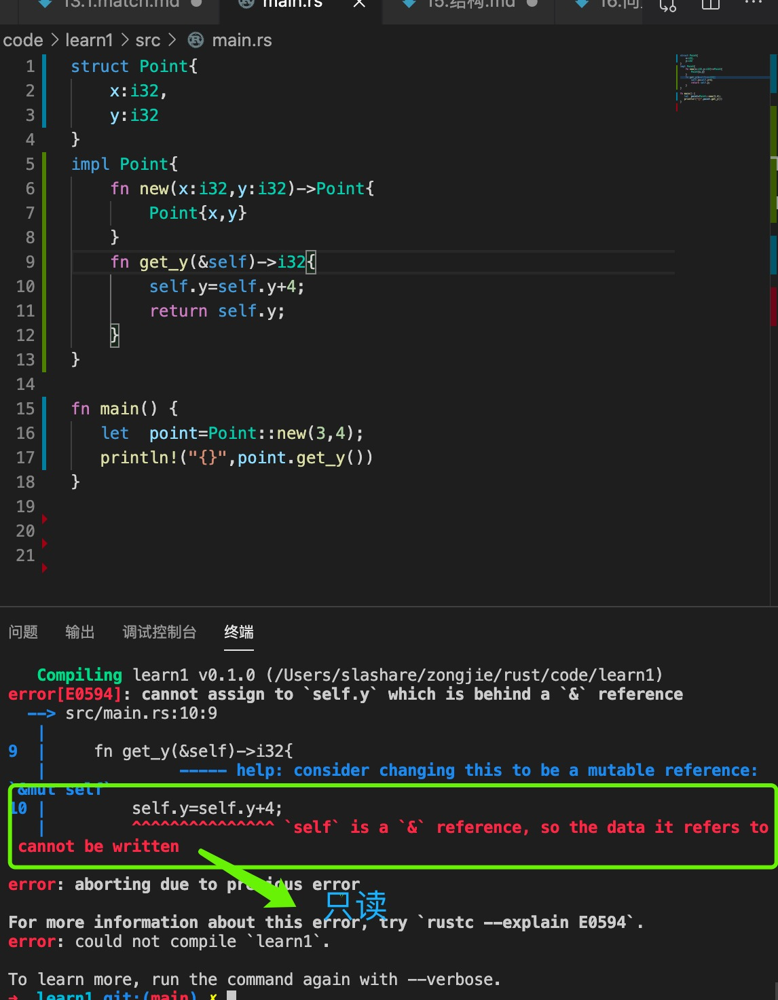
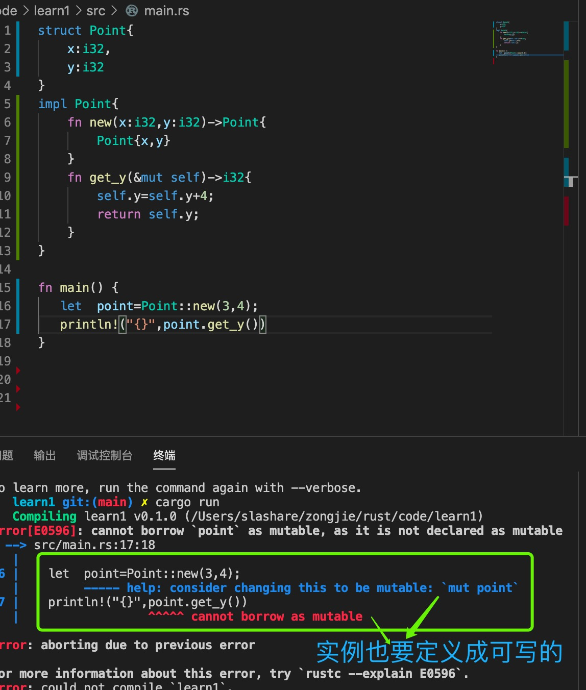
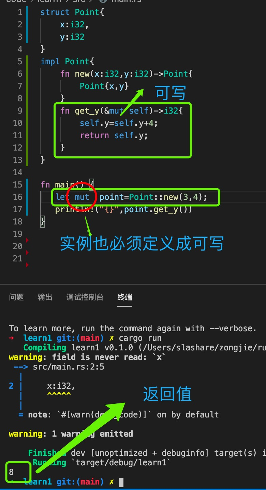

1. 结构的各个部分可以是不同的类型

        struct User {
            username: String,
            email: String,
            sign_in_count: u64,
            active: bool,
        }

2. 实例化结构

        let user1 = User {
            email: String::from("someone@example.com"),
            username: String::from("someusername123"),
            active: true,
            sign_in_count: 1,
        };

   > 实例化结构使用的是{} 而不是()

3. 获取结构中元素

   要从结构中获取特定值，我们可以使用点表示法

        user1.email = String::from("anotheremail@example.com");

4. 结构属性赋值简写

   当变量和字段具有相同名称时，使用字段初始化速记

        fn build_user(email: String, username: String) -> User {
            User {
                email, // 简写，同es6 一样
                username,
                active: true,
                sign_in_count: 1,
            }
        }
        因为email字段和email参数具有相同的名称，所以我们只需要编写email而不是email: email。

5. 结构扩展

          let user2 = User {
            email: String::from("another@example.com"),
            username: String::from("anotherusername567"),
            ..user1 // 结构扩展
         };

6. 在rust 中没有类，使用结构代替类，但是结构只能定义字段，没有方法，使用impl 实现来扩展方法

   > 结构定义, 只能定义字段，

        struct Rectangle {
            width: u32, // 类型必须定义
            height: u32,
        }

   > 定义方法，需要使用impl 实现结构

          impl Rectangle{

          }
    
    + 定义构造方法，一般使用New 或者 from

          impl Rectangle {

              // 有返回值，必须定义返回类型，实例方法返回结构类型  ->Rectangle
              // 参数类型必须定义
              fn New(width:u32,height:u32)->Rectangle {

                  // 可以简写
                  // 最后一行返回不带分号
                  Rectangel { width,height }

              }
          }
     
     + 定义实例方法，实例方法参数第一个参数必须是&self, 代表Rectangle 的实例

            impl Rectangel{
                fn New(width:u32,height:u32)->Rectangel{
                    Rectangle{
                        width,
                        height
                    } // 返回值不带分号
                }

                // rust 命名规则使用下划线，小写
                // 第一个参数必须为&self,代表结构的实例对象
                fn get_w(&self){
                    self.width
                }
            }

        impl Rectangle { // 实现结构
   

            /*
            * 定义方法
            * 方法第一个参数必须为&self,代表结构实例，可以调用实例中的属性
            */
            fn area(&self) -> u32 {
                self.width * self.height
            }
        }

        impl Rectangle {
            fn area(&self) -> u32 {
                self.width * self.height
            }
            
            // 其他方法
            fn can_hold(&self, other: &Rectangle) -> bool {
                self.width > other.width && self.height > other.height
            }
        }

7. 关联函数，在结构中，但是第一个参数不是&self

        impl Rectangle {
            fn square(size: u32) -> Rectangle {
                // 默认最后不带分号的语句为返回值
                Rectangle {
                    width: size,
                    height: size,
                }
            }
        }

   关联函数使用 :: 语法调用

        let sq = Rectangle::square(3);

8. 默认结构中的字段只读

   要想可以写，需要定义成 mut,同时声明实例时，也必须定义成mut,不然报错

