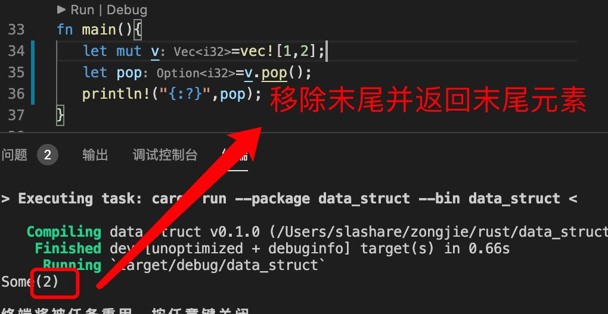
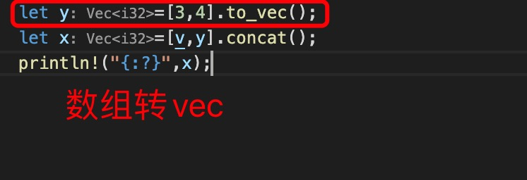
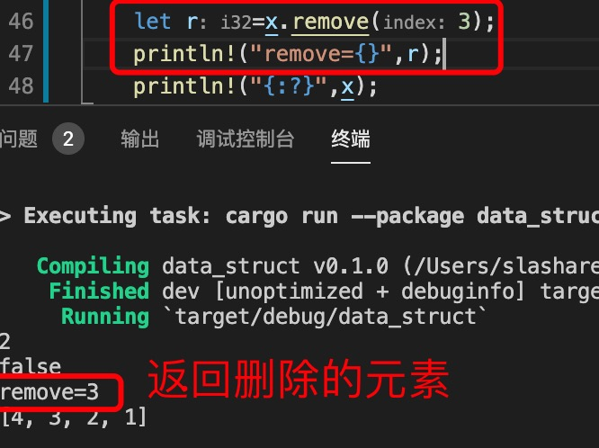
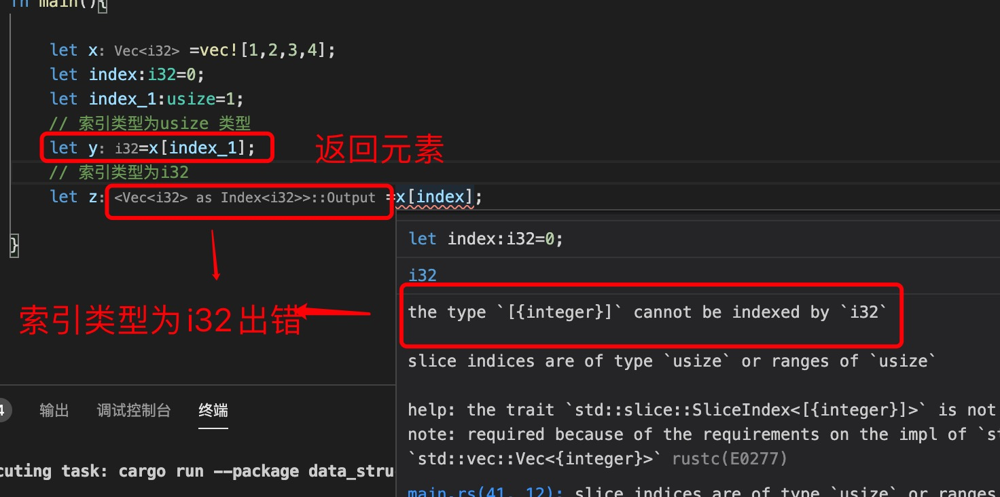
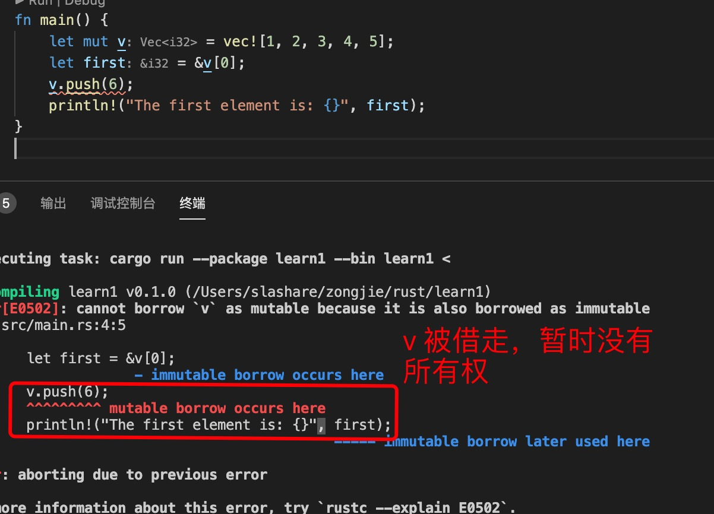

1. Vec <T>

   数组是相同数据类型的值的集合，但***数组有一个缺点，就是它的长度是在编译时就确定的，一旦定义就永不可更改***。

   vec(向量) 是一个***长度可变的数组***。它和数组一样，在内存上开辟一段 连续的内存块 用于存储元素

   向量是在内存堆上存储的。因此长度可变

2. Let v : Vec<i32> = Vec::new();

3. Rust提供vec! 用于创建向量并保存提供的值的宏。

4. 方法：

+ 静态方法new():   创建一个空向量

        let v:Vec<i32>=Vec::new();

+ 实例方法，如果要修改向量，比如 添加，删除，排序，反转等，向量要定义成可变的

        let mut v:Vec<i32>=Vec::new();

   + push(value:T): 末尾追加一个元素

         v.push(1);
         v.push(2);

   + pop()===>Option(T): 移除末尾元素，并返回

        

   + len(): 返回数组长度

         let len:usize = v.len(); // len 返回usize 类型

   + is_empty(): 是否为空
    
        let empty:bool = v.is_empty();//

        如果为空则返回true, 不是空返回false
    + insert(index,element): 在index 处插入元素

        v.insert(1,3);// 返回[1,3,2]
    
    + to_vec: 数组转vec

       
    
    + concat 连接两个数组

            let y=[3,4].to_vec();
            let x=[v,y].concat();
    + reverse: 反转数组
            【1，2，3，4】
            x.reverse();//[4,3,2,1]
    + sort(): 排序

    + sort_by(): 排序

    + remove(index): 删除索引值对应的元素,并返回被删除的元素

        

            let remove=x.remove(3);// 删除元素，并返回被删除的元素
    
    + clear(): 清空整个数组

            x.clear();// 清空
    + join("sep") ：连接

    + connect(""): 连接

    + contains(&key): 是否存在key

            let exist =x.contains(&3);
            println!("{:?}",exist);
    
    + get(index)==>Option<T> 返回Option 类型

            let item =v.get(1);// index 为usize 类型
    
    + append(&mut vec<T>[]): 合并数组

            v.append(&mut vec![8,9,0]);
            println!("v={:?}",v);
    
    + first() // 返回第一个元素的引用

    + splice

5. 索引：在rust 中接收 usize 类型作为数组的索引，使用usize 类型的索引返回元素

   

6. 搜有权

   

7. for 循环

        let mut v = vec![100, 32, 57];
        // 可变引用,这里要使用引用类型，不然会发生moved
        for i in &mut v {
                *i += 50;
        }

        for i in &v{
                println!("{}",i);
        }

        或者使用iter() 或者iter_mut() 转为迭代器

        for i in v.iter(){
                i  为 &i32 类型
        }

