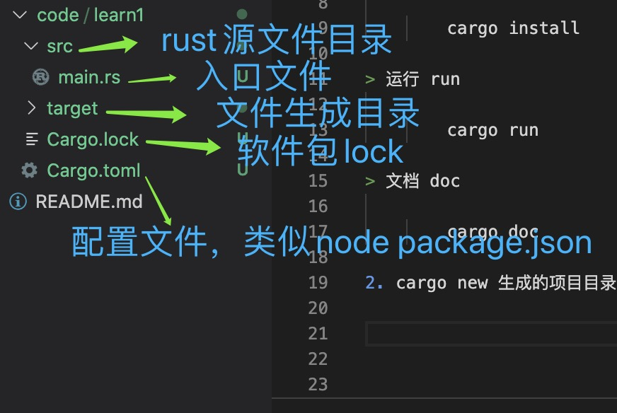

1. Cargo是Rust的构建系统和包管理器

> 创建 new

        cargo new learn1  // 创建learn1 项目, 创建一个用于编写可执行二进制文件的项目

        cargo new --lib lib_create  // 创建一个编写库的项目

> 安装 install 软件包

        cargo install 

> 运行 run 

        cargo run 

> 文档 doc

        cargo doc 

> 构建 build

        cargo build

        cargo build --release

        当项目最终准备好发布时，您可以使用cargo build --release优化进行编译。此命令将在target / release中创建一个可执行文件，而不是target / debug。这些优化使您的Rust代码运行得更快，但是打开它们会延长程序编译的时间。这就是为什么有两个不同的配置文件的原因：一个用于开发，当您想要快速且经常地重建时，另一个用于构建最终程序，您将提供给不会重复重建且运行速度与用户相同的用户可能。如果要对代码的运行时间进行cargo buil

2. cargo new 生成的项目目录

   

   Cargo希望您的源文件位于src目录中。顶级项目目录仅用于自述文件，许可证信息，配置文件以及与您的代码无关的其他任何内容。

3. Cargo 遵循的一个约定：src/main.rs 就是一个与包同名的二进制 crate 的 crate 根

   Cargo 知道如果包目录中包含 src/lib.rs，则包带有与其同名的库 crate，且 src/lib.rs 是 crate 根。

4. https://crates.io/crates/mysql 第三方包
