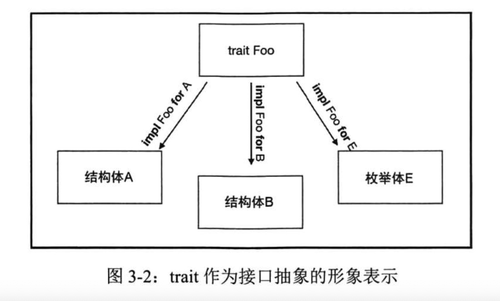
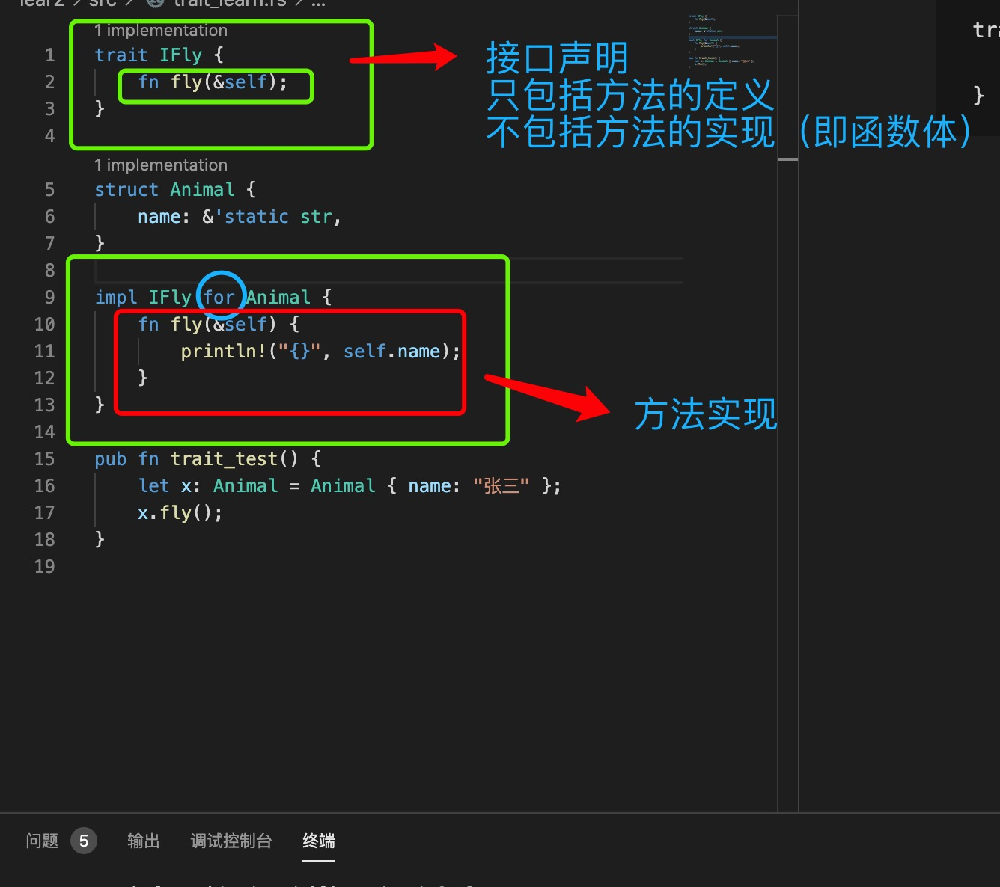
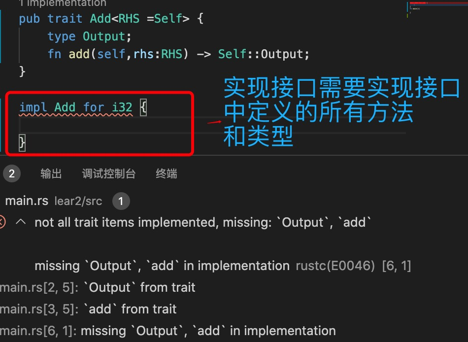
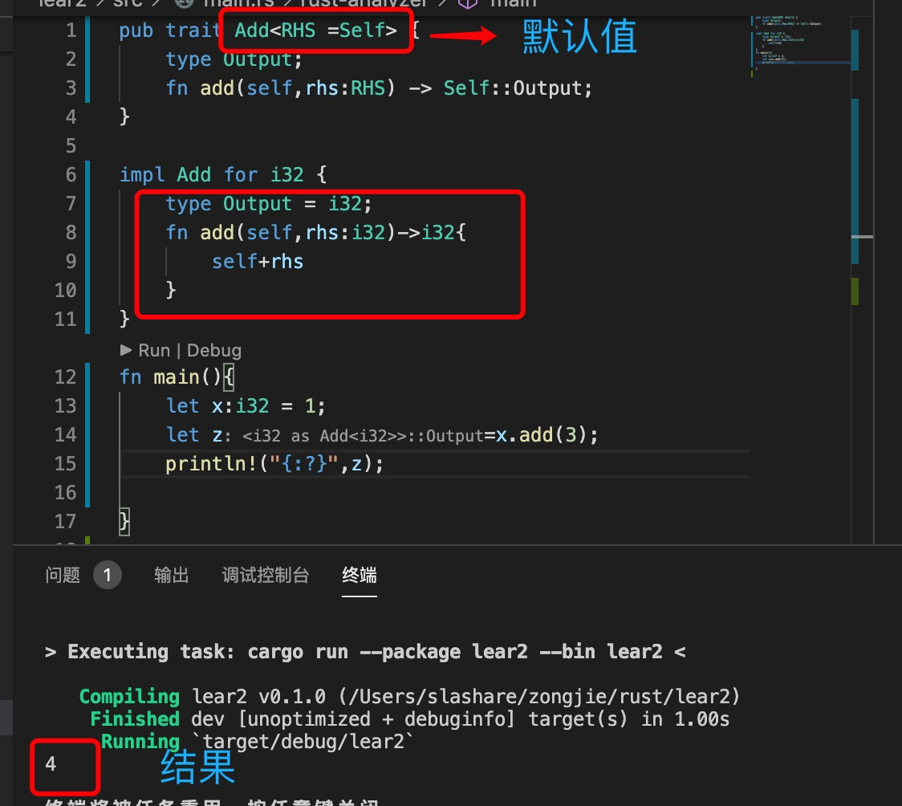
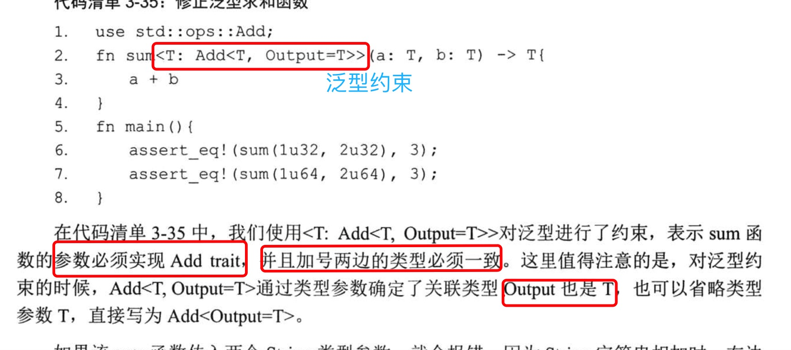
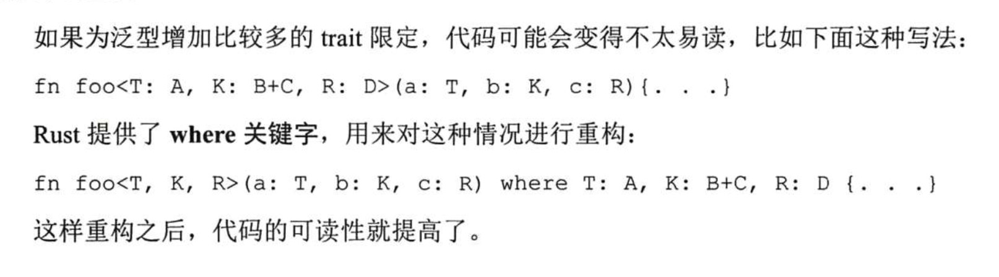
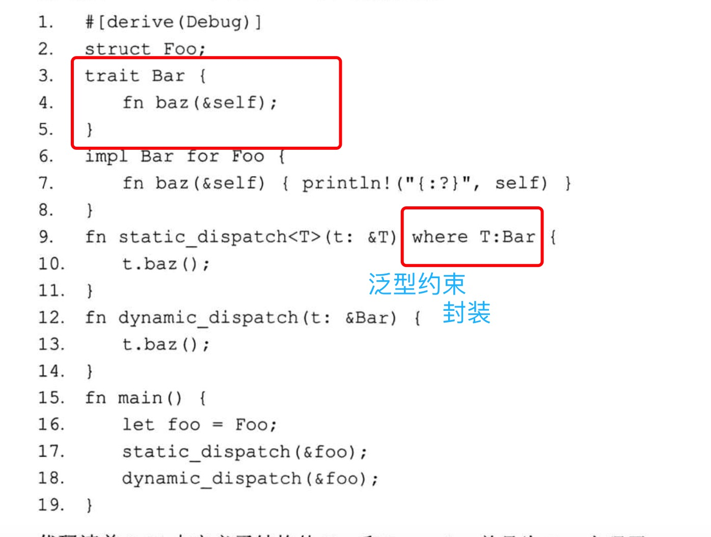
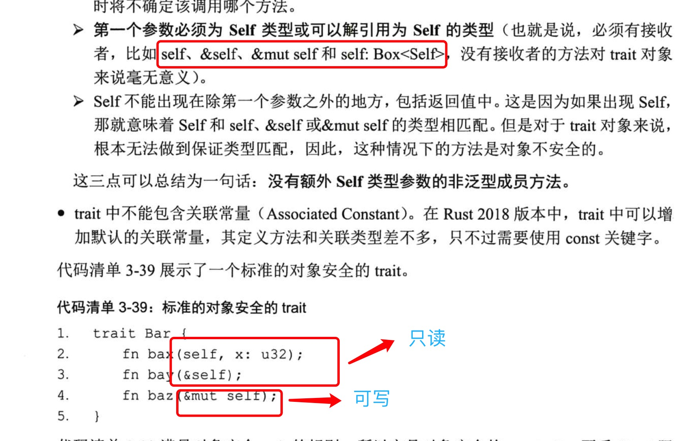
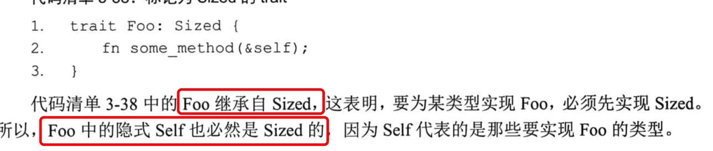

1. trait 是rust 唯一的接口抽象方式。

   

   trait 实现方法的抽象，之定义方法的声明，没有***实现函数体***

   

2. 实现接口使用impl TraitName for StructName

   

3. 示例

        trait Fly{
            fn fly(&self) ->bool; // 方法的声明
        }

        impl IFly for Animal{

        }

        impl 实现trait

        for: 标明为那个结构体实现此接口中的方法

3. 关联类型参数

   

4. 泛型约束

   
   
   

5. self

   

6. 继承（标签）

   
