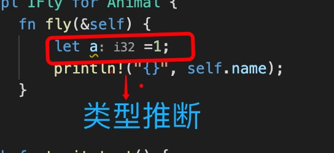
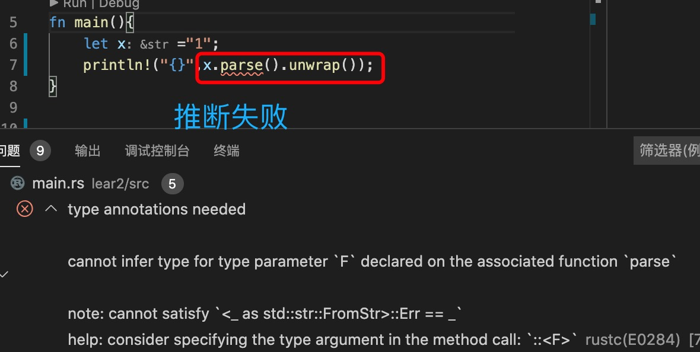

1. rust 支持类型推断，但是rust 推断只能在局部范围内进行推导。

   
   

2. 有时候rust 无法推断类型，编译器会通过报错提示

   

> 解决办法：

+ 明确表明返回变量的类型

        let x ="1";
        let int_x:i32 = x.parse().unwrap();// 表明变量类型

+ 使用泛型

        let x ="1";
        let int_x= x.parse::<i32>().unwrap();
        
        ::<> 叫做turbofish 操作符