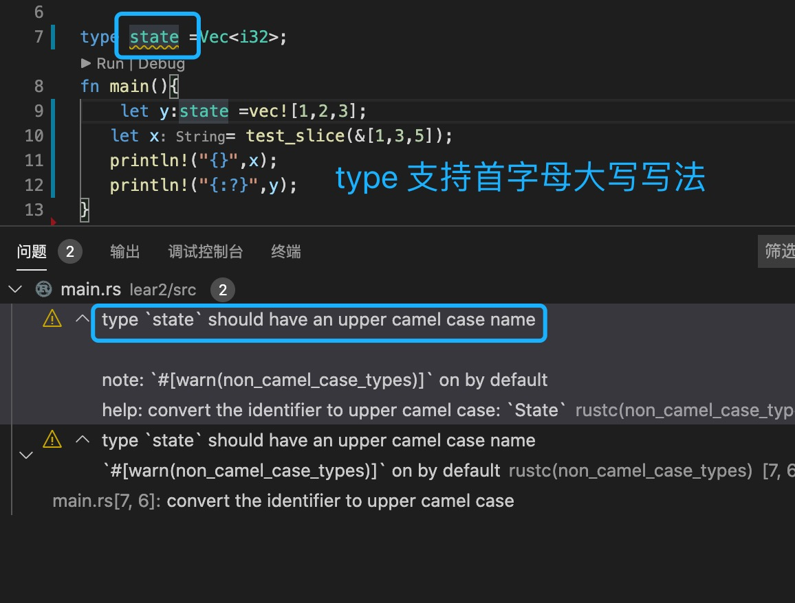

1. 有时候类型比较负责，我们可以使用type 为复杂的类型设置一个别名，比如：

            type State =Vec<Vec<Person>>;

            let x:State =vec![vec![Person{name:123}]];

            type State =Vec<i32>;
            fn main(){
                let y:State =vec![1,2,3];
                println!("{:?}",y);
            }

   