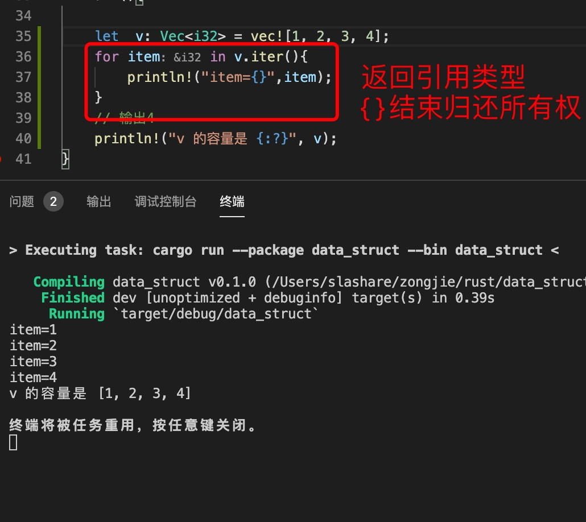
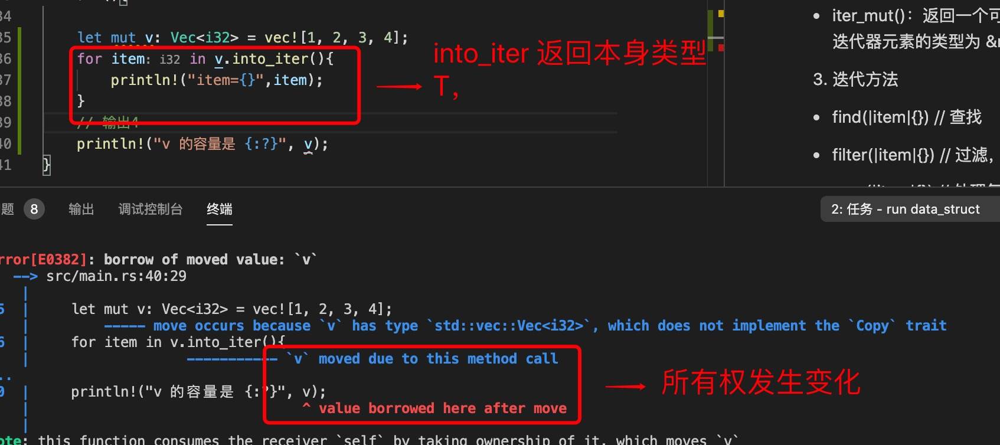
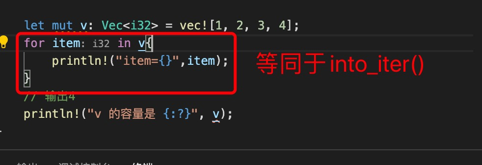
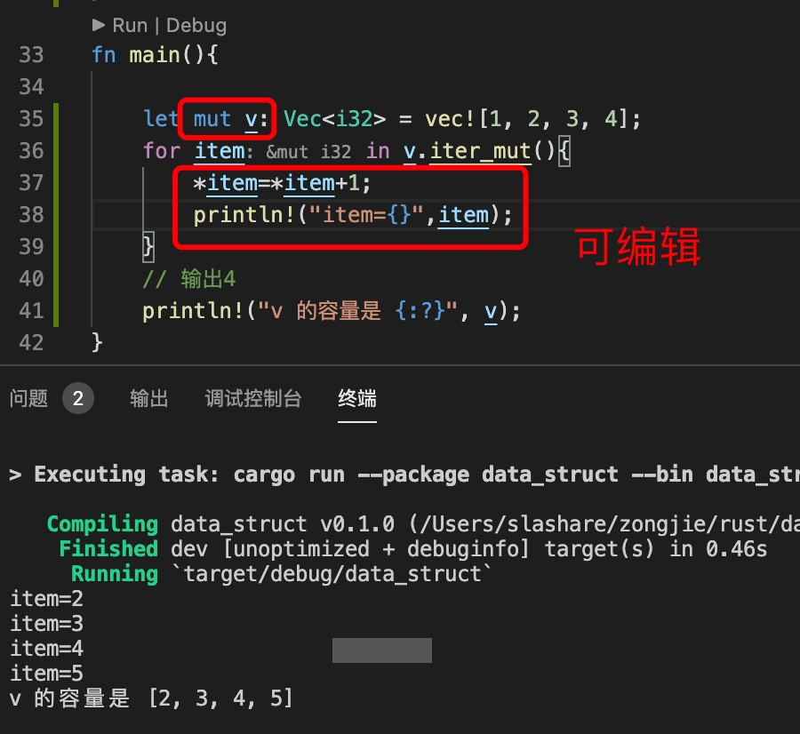

0. rust 中集合包括数组（array）,向量（vec!),哈希表（map)

    rust 中所有集合都实现了Iterator 特质，
    两个必须实现的函数：

    iter()

    next():// 末尾返回None

1. iter 迭代

   for 循环

        for iterator_item in iterator {
                // 使用迭代项的具体逻辑
            }

2. 迭代所有权

+ iter()： 返回一个***只读***可重入迭代器，迭代器元素的类型为 &T

   

+ into_iter()：返回一个只读不可重入迭代器，迭代器元素的类型为 T

   ***所有权会发生变化***

   迭代器之后集合不可再重复使用，因为元素都被拷贝走了

   
   

+ iter_mut()：返回一个***可修改***可重入迭代器，迭代器元素的类型为 &mut T

   

3. 迭代方法

+ find(|item|{}) // 查找

+ filter(|item|{})  // 过滤，返回新数组

+ map(|item|{}) // 处理每一项并返回处理以后的元素

+ any(|item|{}) // 任意条件返回true,则为true,  都不满足则返回false

+ all(|item|{}) // 全部满足true, 则返回true，不然否会false

+ flod() // 类似于js 的reduce

+ 