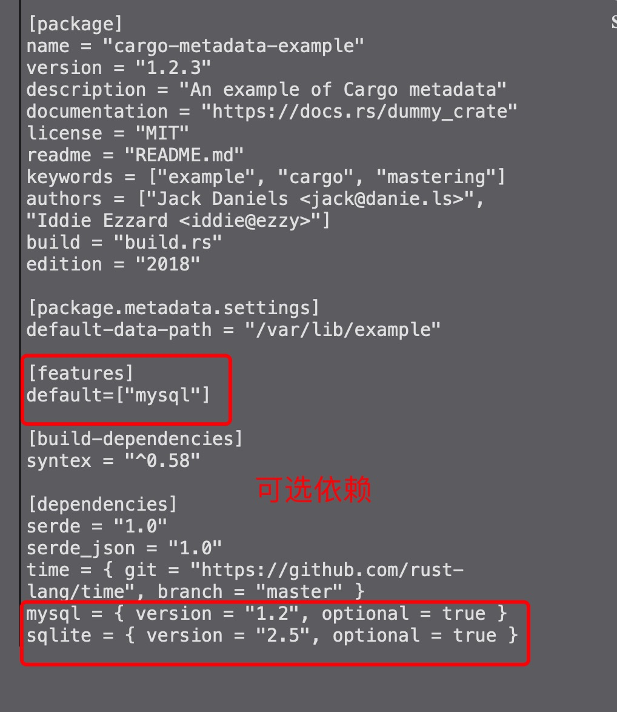

1. rust 使用toml 作为配置文件

        [package]
        name = "learn1"
        version = "0.1.0"
        authors = ["li <lwaisyj@163.com>"]
        edition = "2018"

        # See more keys and their definitions at https://doc.rust-lang.org/cargo/reference/manifest.html

        [dependencies]

2. 参数项说明

> package 当前项目或rust 包说明

+ name: 项目或rust 包名称

+ version: 版本

+ description: 描述

+ license: "MIT" 协议

+ readme ="readme.md" // 一个文件链接关于项目的介绍

+ documentation: 文档地址

+ keywords: 关键字

+ build: 它定义了一段Rust代码（通常为build.rs），该Rust代码在程序其余部分编译之前就已编译并运行。这通常用于生成代码或构建箱子所依赖的本机库

+ authors: 作者

+ edition： Rust版本，指定在编译项目时使用哪个版本

> dependencies: 依赖项，当前项目依赖的rust 软件包

+ git 

        time = { git = "https://github.com/rust-lang/time", branch = "master" }
+ 可选

       mysql = { version = "1.2", optional = true }

     

> workspace: 工作区

   随着时间的推移，您的项目已经变得非常庞大。现在，您正在考虑是否可以将代码的公共部分拆分为单独的板条箱以帮助管理复杂性。好吧，“货物”工作区可让您做到这一点。工作区的概念是，它们允许您在可共享相同Cargo.lock文件和公共目标或输出目录的目录中本地存储板条箱。为了演示这一点，我们将创建一个包含Cargo工作区的新项目。该工作空间不过是其中包含Cargo.toml文件的目录。它没有任何[package]部分，但是其中有[workspace]部分。让我们创建一个名为workspace_demo的新目录并添加Cargo.toml文件，如下所示：

                mkdir workspace_demo
                cd workspace_demo && touch Cargo.toml

        [workspace]
        members = ["my_crate", "app"]

