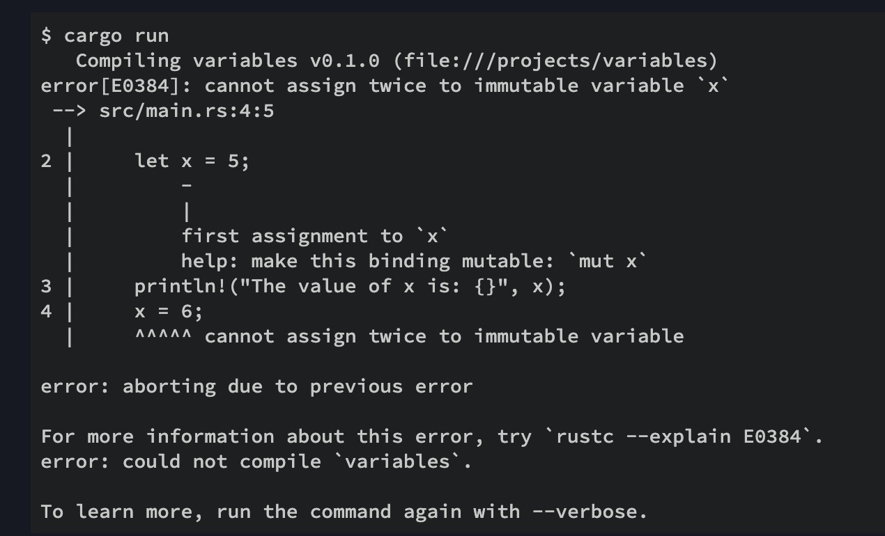

1. rust 变量必须先声明再使用

        let a:type ;

2.  rust 变量和其他语言不通的是多了可变性（mut)

> 如果变量是不可变的，则将值绑定到名称后，就无法再更改该值

        fn main() {
            let x = 5;
            println!("The value of x is: {}", x);
            x = 6;
            println!("The value of x is: {}", x);
        }

错误消息表明错误的原因是您cannot assign twice to immutable variable x，因为您试图为不可变x变量分配第二个值。

**注意**

> 要想要变量可变，必须使用mut 定义，

        let mut x=5;

3.  rust 是强类型的语言，一旦类型确定，就不能再赋值其他类型的值，比如如果一个变量时数字类型，就不能再赋值字符串类型给该变量

        fn main() {
            let mut x =5; // 数字类型
            x="hello rust"; // 字符串类型
            println!(x);
        }
        

4. const 常量

   const关键字而不是关键字声明常量let，并且值的类型必须带注释

        const MAX_POINTS: u32 = 100_000;

5. 重影

   可以声明一个与先前变量同名的新变量，并且该新变量会覆盖先前的变量。Rustaceans说，第一变量被遮蔽由第二装置，该装置使得所述第二变量的值是使用该变量时显示的内容。我们可以通过使用相同变量的名称并重复使用let关键字来对变量进行阴影处理

        fn main() {
            let x = 5;

            let x = x + 1;

            let x = x * 2;

            println!("The value of x is: {}", x);
        }

该程序首先绑定x到的值5。然后x通过重复let x =进行阴影处理，取原始值并相加1， x然后得到6。第三个let声明还阴影x，以前值乘以2给x的最终值12