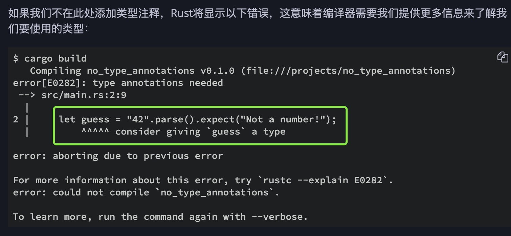

1. rust 是强类型的语言，虽然可以使用类型推到，但是rust 是强类型的

   Rust是一种静态类型的语言，这意味着它必须在编译时知道所有变量的类型

   编译器通常可以根据值以及如何使用它来推断我们要使用的类型。在当许多类型是可能的，比如当我们转换的情况下String，使用数字式parse，我们必须添加类型注释

        let guess: u32 = "42".parse().expect("Not a number!");
   

2. 基础类型

+ 整数

+ 浮点数

+ bool

+ 字符(char)

+ 字符串

+ 数组

+ 元组

+ None

3. 类型转换

   rust不提供原始类型之间的隐式类型转换（强制）。但是，可以使用as关键字执行显式类型转换

         let decimal = 65.4321_f32;

         // Error! No implicit conversion
         let integer: u8 = decimal;
         // FIXME ^ Comment out this line

         // Explicit conversion
         let integer = decimal as u8;
         let character = integer as char;

         // Error! There are limitations in conversion rules. A float cannot be directly converted to a char.
         let character = decimal as char;

4. 类型别名 type

  该type语句可用于为现有类型赋予新名称。类型必须具有UpperCamelCase(大写驼峰)名称

      type NanoSecond = u64;
      type Inch = u64;

      // Use an attribute to silence warning.
      #[allow(non_camel_case_types)]
      type u64_t = u64;
      // TODO ^ Try removing the attribute

      let nanoseconds: NanoSecond = 5 as u64_t;
      let inches: Inch = 2 as u64_t;