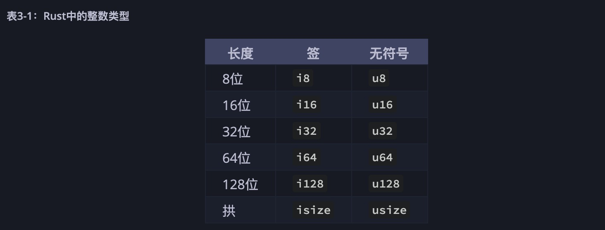

1. 整数

   有符号和无符号，

   有符号（+（正），-（负））

   无符号从0开始

   

   每个带符号的变量可以存储-（2 n-1）到2 n-1-1之间的数字，其中n是变量使用的位数。因此，一个 i8可从存储号码- （2 7）至2 7 - 1，其等于-128到127无符号的变体可以存储从0编号，以2 Ñ - 1，所以u8可以从0存储编号，以2 8 - 1，等于0到255。

2. 浮点数

   Rust对于浮点数也有两种原始类型，即带小数点的数字。Rust的浮点类型为f32和f64，大小分别为32位和64位。默认类型是f64 因为在现代CPU上，它的速度与之大致相同，f32但精度更高。

        fn main() {
            let x = 2.0; // f64

            let y: f32 = 3.0; // f32
        }

   浮点数根据IEEE-754标准表示。该 f32类型是单精度浮点，并且f64具有双精度。

3. 运算符

+ 加 +

+ 减 -

+ 乘 *

+ 除 /

+ 求余 %

4. 方法

+ to_string() ： 转换成字符串

+ pow(n) : n次方(i32)

+ abs() : 取正

+ max_value()

+ min_value()

5. 关联函数

+ MIN：最小值

         i32::MIN

+ MAX: 最大值

         i32::MAX

6. usize 和 isize 取决于操作系统32位还是64位