0. 所有权

   每个值在rust 中都有一个变量来管理它，这个变量就是这个值，这块内存的所有者。

   ***每个值在一个时间点上只有一个管理者***，

   当变量所在的作用域（{}花括号作用域）结束的时候，变量和变量代表的值会被销毁

> 变量生命周期

        fn main(){
            let mut s = String::from("hello");
            s.push_str(" rust!");// 追加
            println!("{}",s);
        }
        声明了s,那么值hello 的所有者就是s, 当main 执行结束，s将会被析构，他管理的内存（不管是栈上还是堆上）会被释放。

   我们把变量从出生到死亡的整个阶段，叫作一个变量的“生命周期".

1. 所有权发生moved 的情况

   所有权moved 以后，不能再使用

+ 赋值给另一个变量

        let x =vec![1,2,3];
        let y=x;
        println!("{:?}",x);// 错误，已发生转移

   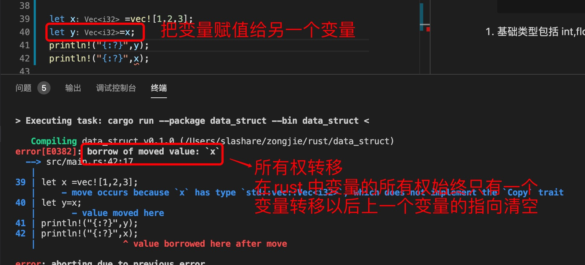

+ 作为参数

   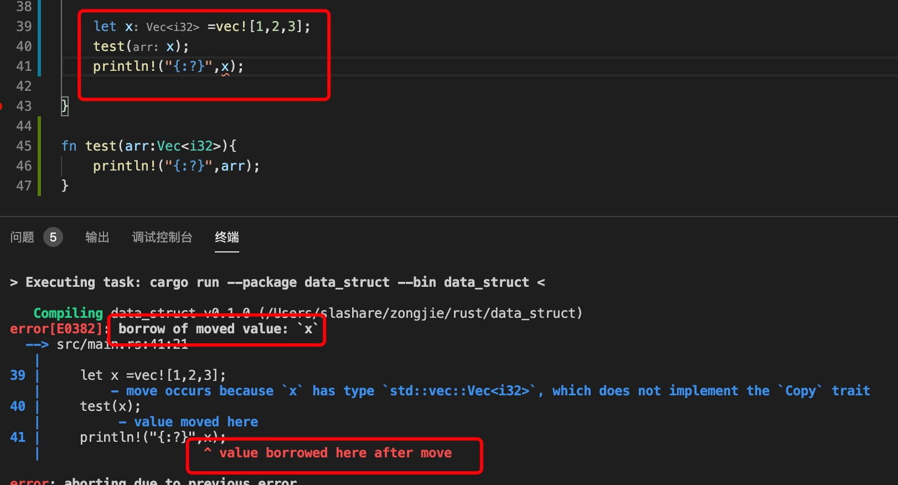

   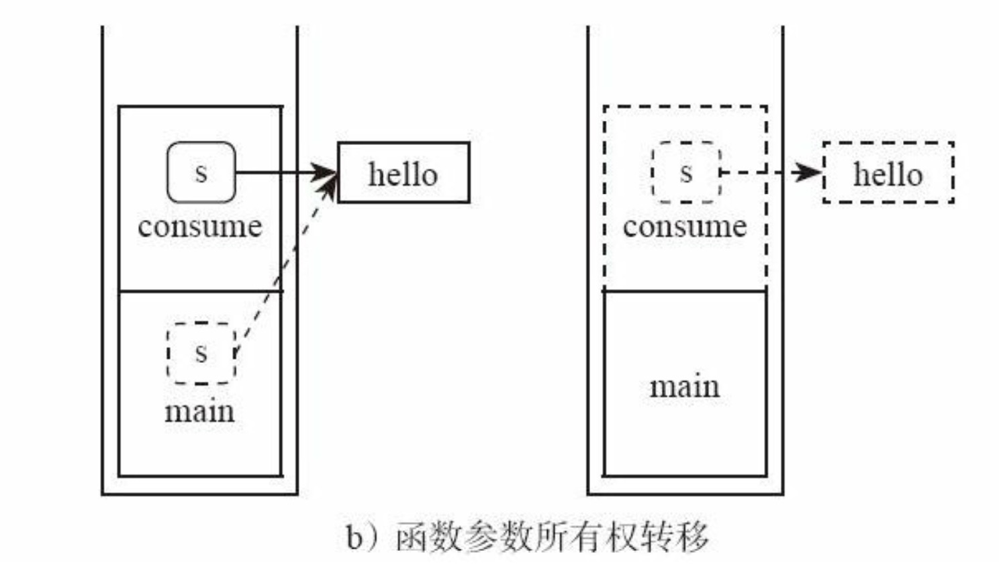

+ 作为返回值

        fn create() -> String {
            let s = String::from("hello");
            return s; // 所有权转移,从函数内部移动到外部
        }

   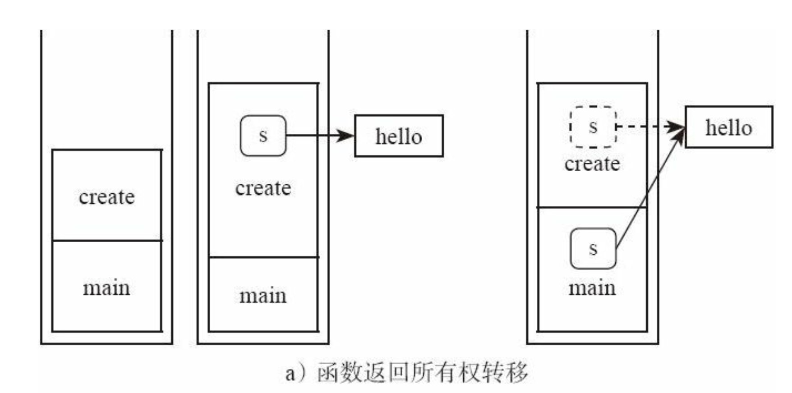

2. 标量类型包括 int,float,char,bool,&str 实现了copy(复制)的，在传递时会调用copy ，拷贝一个副本给变量，并不影响值的改变

+ 变量赋值

   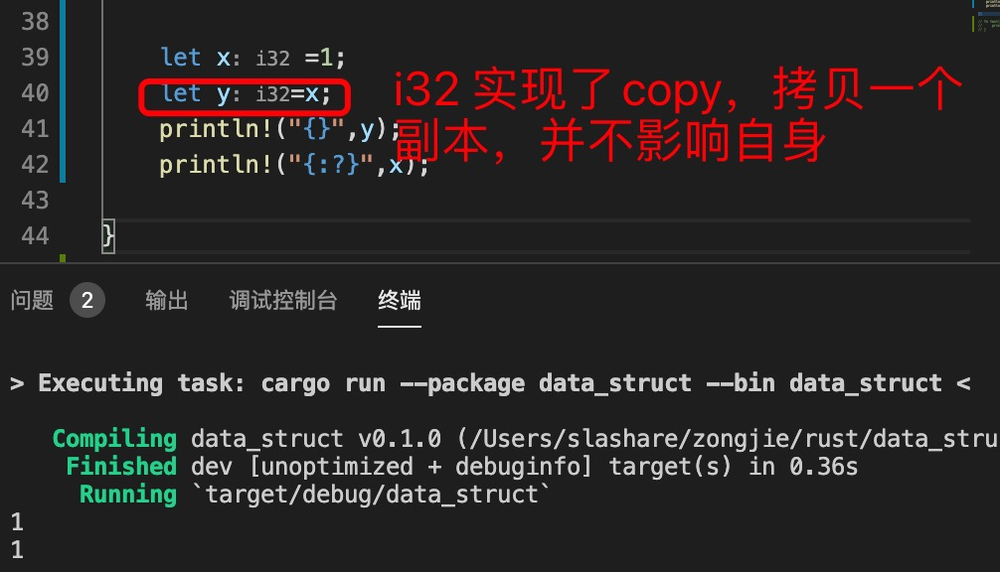

   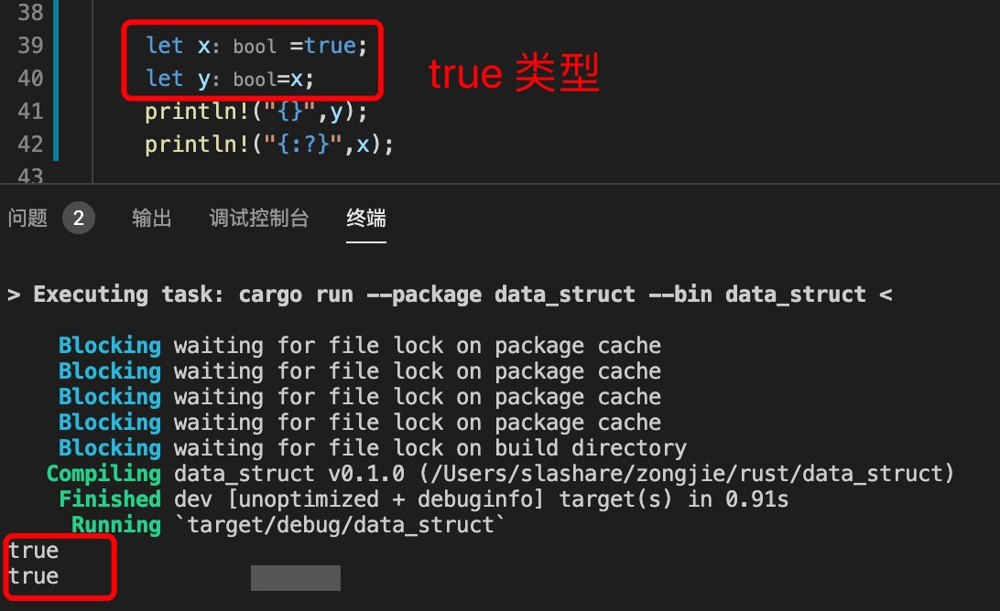

   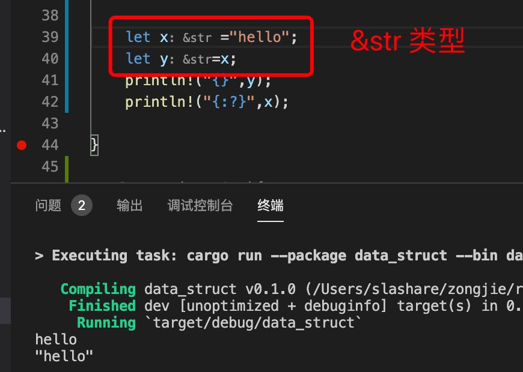

> 数组和元组都里面的元素都实现了copy 类型，

   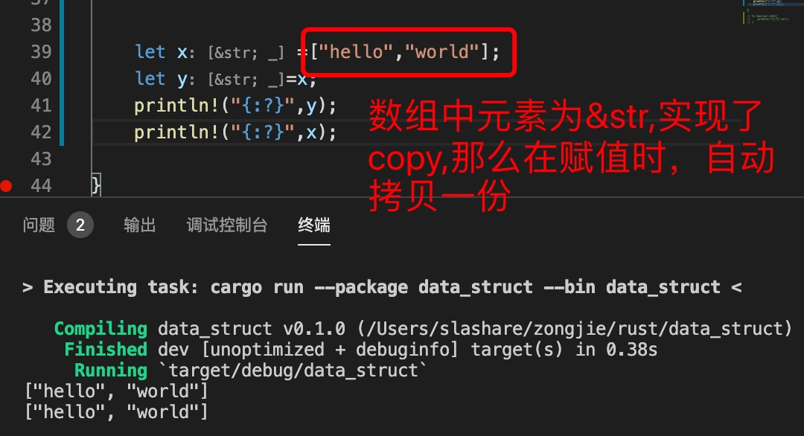

   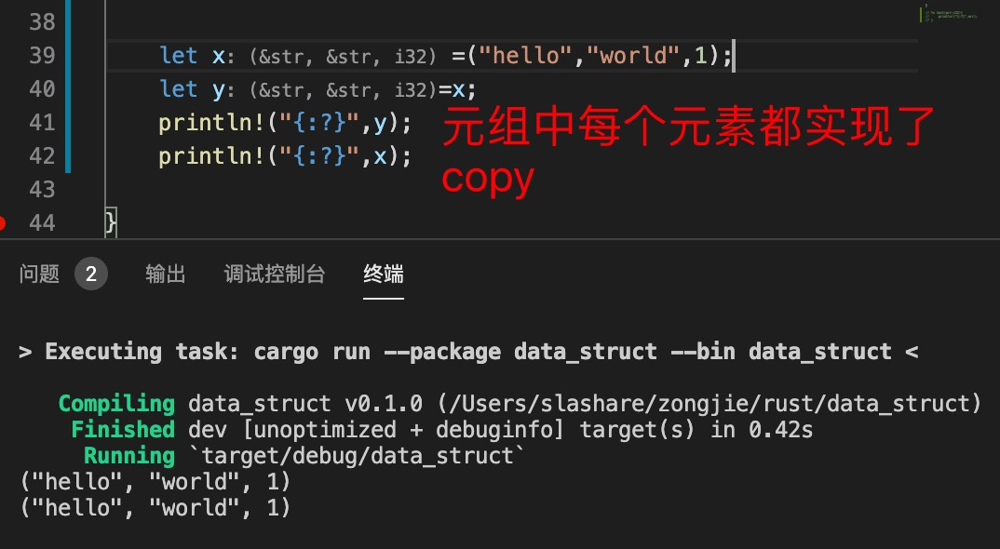

> 数组和元组里面的元素没有实现Copy,会发生转移（move）

   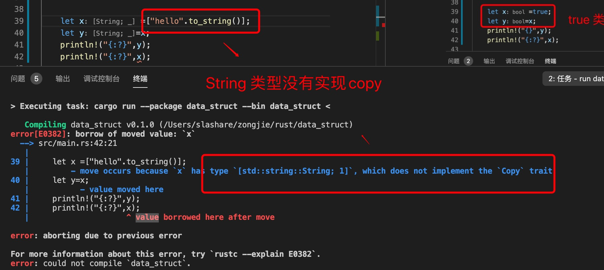

3. clone(): 拷贝一个副本

   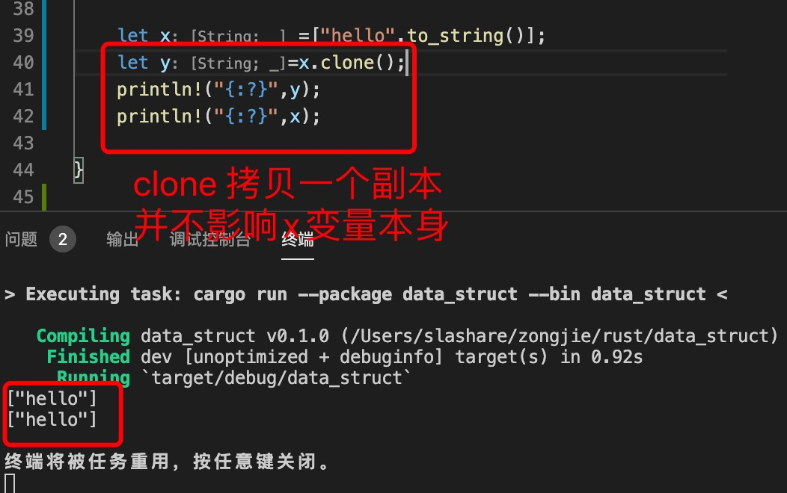