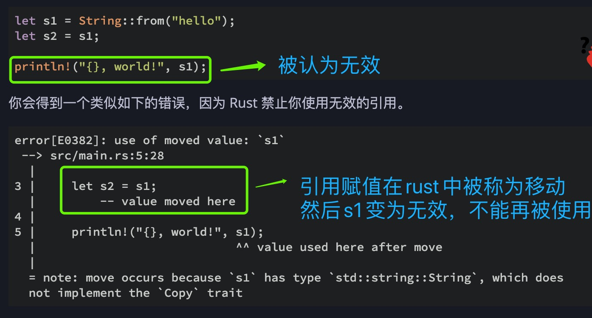
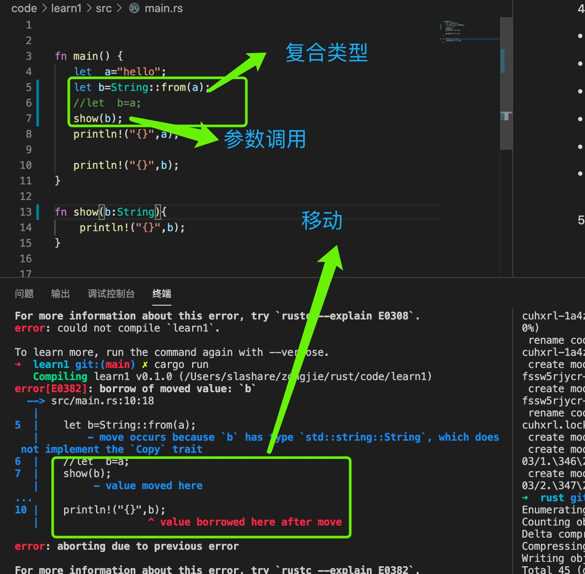

1. 基础类型

>（1） 基础类型 int,float,bool,&str,char

        let x = 5;
        let y = x;

   我们大致可以猜到这在干什么：“将 5 绑定到 x；接着生成一个值 x 的拷贝并绑定到 y”。现在有了两个变量，x 和 y，都等于 5。这也正是事实上发生了的，因为整数是有已知固定大小的简单值，所以这两个 5 被放入了栈中。

   **注意**

   > ***基础类型是赋值了一份值给新变量，不影响原来的变量***

>(2) 复合类型

        let s1 = String::from("hello");
        let s2 = s1;

   这看起来与上面的代码非常类似，所以我们可能会假设他们的运行方式也是类似的：也就是说，第二行可能会生成一个 s1 的拷贝并绑定到 s2 上。***不过，事实上并不完全是这样***

   看看图 1 以了解 String 的底层会发生什么。String 由三部分组成，如图左侧所示：一个指向存放字符串内容内存的指针，一个长度，和一个容量。这一组数据存储在栈上。右侧则是堆上存放内容的内存部分。

   

   图 1：将值 "hello" 绑定给 s1 的 String 在内存中的表现形式

   长度表示 String 的内容当前使用了多少字节的内存。容量是 String 从操作系统总共获取了多少字节的内存。长度与容量的区别是很重要的，不过在当前上下文中并不重要，所以现在可以忽略容量。

   当我们将 s1 赋值给 s2，String 的数据被复制了，这意味着我们从栈上拷贝了它的指针、长度和容量。我们并没有复制指针指向的堆上数据。换句话说，内存中数据的表现如图 2 所示

   

   图 2：变量 s2 的内存表现，它有一份 s1 指针、长度和容量的拷贝

   这个表现形式看起来 并不像 图 4-3 中的那样，如果 Rust 也拷贝了堆上的数据，那么内存看起来就是这样的。如果 Rust 这么做了，那么操作 s2 = s1 在堆上数据比较大的时候会对运行时性能造成非常大的影响。

   

    图 3：另一个 s2 = s1 时可能的内存表现，如果 Rust 同时也拷贝了堆上的数据的话

   之前我们提到过当变量离开作用域后，Rust 自动调用 drop 函数并清理变量的堆内存。不过图 4-2 展示了两个数据指针指向了同一位置。这就有了一个问题：当 s2 和 s1 离开作用域，他们都会尝试释放相同的内存。这是一个叫做 ***二次释放（double free)的错误***，也是之前提到过的内存安全性 bug 之一。两次释放（相同）内存会导致内存污染，它可能会导致潜在的安全漏洞。

   为了确保内存安全，这种场景下 Rust 的处理有另一个细节值得注意。***与其尝试拷贝被分配的内存，Rust 则认为 s1 不再有效***，因此 Rust 不需要在 s1 离开作用域后清理任何东西。看看在 s2 被创建之后尝试使用 s1 会发生什么；这段代码不能运行：

            let s1 = String::from("hello");
            let s2 = s1;

            println!("{}, world!", s1);

   

   如果你在其他语言中听说过术语 浅拷贝（shallow copy）和 深拷贝（deep copy），那么拷贝指针、长度和容量而不拷贝数据可能听起来像浅拷贝。不过因为 ***Rust同时使第一个变量无效了，这个操作被称为 移动（move），而不是浅拷贝***。上面的例子可以解读为 s1 被 移动 到了 s2 中。那么具体发生了什么，如图 4-4 所示。

   

   图 4：s1 无效之后的内存表现

   这样就解决了我们的问题！因为***只有 s2 是有效的，当其离开作用域，它就释放自己的内存，完毕***。

   另外，这里还隐含了一个设计选择：***Rust 永远也不会自动创建数据的 “深拷贝”***。因此，任何 自动 的复制可以被认为对运行时性能影响较小。

2. 克隆

   如果我们 确实 需要深度复制 String 中堆上的数据，而不仅仅是栈上的数据，可以使用一个叫做 clone 的通用函数。第五章会讨论方法语法，不过因为方法在很多语言中是一个常见功能，所以之前你可能已经见过了。

   这是一个实际使用 clone 方法的例子：

        let s1 = String::from("hello");
        let s2 = s1.clone();

        println!("s1 = {}, s2 = {}", s1, s2);
   这段代码能正常运行，并且明确产生图 4-3 中行为，这里堆上的数据 确实 被复制了。

   当出现 clone 调用时，你知道一些特定的代码被执行而且这些代码可能相当消耗资源。你很容易察觉到一些不寻常的事情正在发生。

3. 基础类型自动克隆

    这里还有一个没有提到的小窍门。这些代码使用了整型并且是有效的，他们是示例 4-2 中的一部分：

        let x = 5;
        let y = x;

        println!("x = {}, y = {}", x, y);

   但这段代码似乎与我们刚刚学到的内容相矛盾：没有调用 clone，不过 x 依然有效且没有被移动到 y 中。

   原因是像整型这样的在编译时已知大小的类型被整个存储在栈上，所以拷贝其实际的值是快速的。这意味着没有理由在创建变量 y 后使 x 无效。换句话说，这里没有深浅拷贝的区别，所以这里调用 clone 并不会与通常的浅拷贝有什么不同，我们可以不用管它

4. copy 的类型

+ 所有整数类型，比如 u32。

+ 布尔类型，bool，它的值是 true 和 false。

+ 所有浮点数类型，比如 f64。

+ 字符类型，char。

+ &str

+ 元组，当且仅当其包含的类型也都是 Copy 的时候。比如，(i32, i32) 是 Copy 的，但 (i32, String) 就不是。

5. 函数参数传递移动

   将值传递给函数在语义上与给变量赋值相似。向函数传递值可能会移动或者复制，就像赋值语句一样。示例 4-3 使用注释展示变量何时进入和离开作用域：

        fn main() {
            let s = String::from("hello");  // s 进入作用域

            takes_ownership(s);             // s 的值移动到函数里 ...
                                            // ... 所以到这里不再有效

            let x = 5;                      // x 进入作用域

            makes_copy(x);                  // x 应该移动函数里，
                                            // 但 i32 是 Copy 的，所以在后面可继续使用 x

        } // 这里, x 先移出了作用域，然后是 s。但因为 s 的值已被移走，
        // 所以不会有特殊操作

        fn takes_ownership(some_string: String) { // some_string 进入作用域
            println!("{}", some_string);
        } // 这里，some_string 移出作用域并调用 `drop` 方法。占用的内存被释放

        fn makes_copy(some_integer: i32) { // some_integer 进入作用域
            println!("{}", some_integer);
        } // 这里，some_integer 移出作用域。不会有特殊操作

6. 返回值与作用域

    返回值也可以转移所有权。示例 4-4 与示例 4-3 一样带有类似的注释。

   文件名: src/main.rs

            fn main() {
                let s1 = gives_ownership();         // gives_ownership 将返回值
                                                    // 移给 s1

                let s2 = String::from("hello");     // s2 进入作用域

                let s3 = takes_and_gives_back(s2);  // s2 被移动到
                                                    // takes_and_gives_back 中,
                                                    // 它也将返回值移给 s3
            } // 这里, s3 移出作用域并被丢弃。s2 也移出作用域，但已被移走，
            // 所以什么也不会发生。s1 移出作用域并被丢弃

            fn gives_ownership() -> String {             // gives_ownership 将返回值移动给
                                                        // 调用它的函数

                let some_string = String::from("hello"); // some_string 进入作用域.

                some_string                              // 返回 some_string 并移出给调用的函数
            }

            // takes_and_gives_back 将传入字符串并返回该值
            fn takes_and_gives_back(a_string: String) -> String { // a_string 进入作用域

                a_string  // 返回 a_string 并移出给调用的函数
            }
    
    变量的所有权总是遵循相同的模式：将值赋给另一个变量时移动它。当持有堆中数据值的变量离开作用域时，其值将通过 drop 被清理掉，除非数据被移动为另一个变量所有。

   在每一个函数中都获取所有权并接着返回所有权有些啰嗦。如果我们想要函数使用一个值但不获取所有权该怎么办呢？如果我们还要接着使用它的话，每次都传进去再返回来就有点烦人了，除此之外，我们也可能想返回函数体中产生的一些数据。