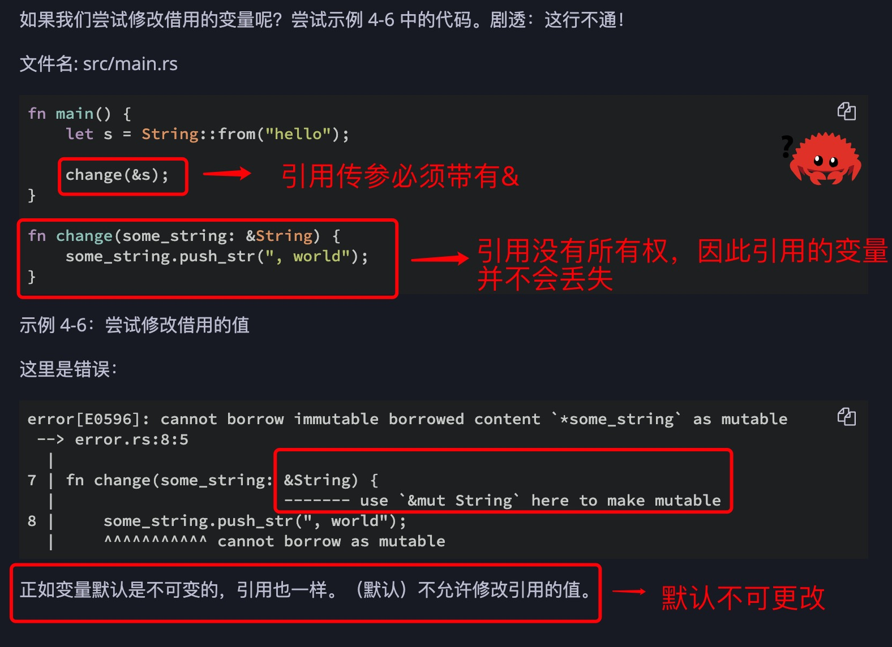
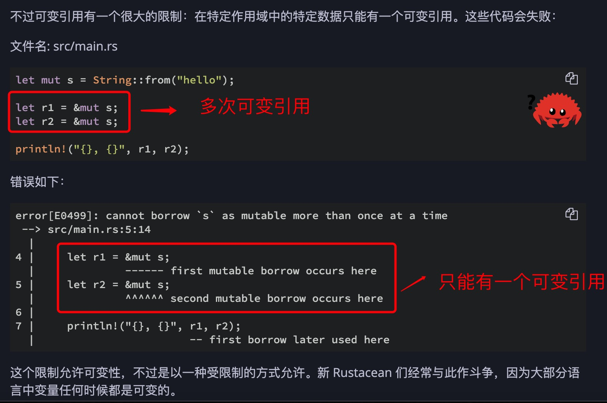

1. 对于复合类型来说，移动完以后，默认变量自动销毁

2. & 引用，***它们允许你使用值但不获取其所有权***，代码还可以使用

        let a = String::from("hello");
        let b =&a;  // 使用引用，不改变所有权
        print("{}",a); // hello ，
        print("{}",b); // hello 

        实例二：

        fn hello(a:&String){ // 定义参数是类型不能省略，使用&
            print("{}",a);
        }

        let a = String::from("hello");

        hello(&a); // 传递参数时，& 不能省略
        print("{}",a);
        print("{}",b);

3. 实例解说

        let s1 = String::from("hello");

        let len = calculate_length(&s1);

        fn calculate_length(s: &String) -> usize {
            s.len()  // 最后语句不带分号，默认为return s.len();
        }

   &s1 语法让我们创建一个 指向 值 s1 的引用，但是并不拥有它。因为并不拥有这个值，当引用离开作用域时其指向的值也不会被丢弃。

   同理，函数签名使用 & 来表明参数 s 的类型是一个引用。让我们增加一些解释性的注释：

        fn calculate_length(s: &String) -> usize { // s 是对 String 的引用
            s.len()
        } // 这里，s 离开了作用域。但因为它并不拥有引用值的所有权，
        // 所以什么也不会发生

    >当函数使用引用而不是实际值作为参数，无需返回值来交还所有权，因为就不曾拥有所有权。

4. 借用

    我们将获取引用作为函数参数称为 借用（borrowing）

    正如现实生活中，如果一个人拥有某样东西，你可以从他那里借来。当你使用完毕，必须还回去。

    > 默认不能修改引用的值

    

    > 可变引用  &mut

        fn main() {
            let mut s = String::from("hello");

            change(&mut s);
        }

        fn change(some_string: &mut String) {
            some_string.push_str(", world");
        }

5.  引用规则

   + 在任意给定时间，要么 只能有一个可变引用，要么 只能有多个不可变引用。

    

   + 引用必须总是有效的