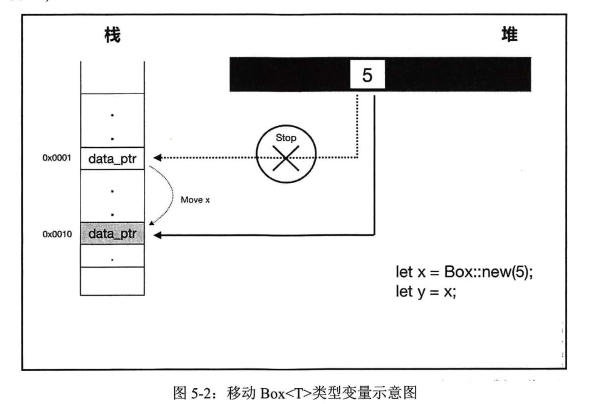
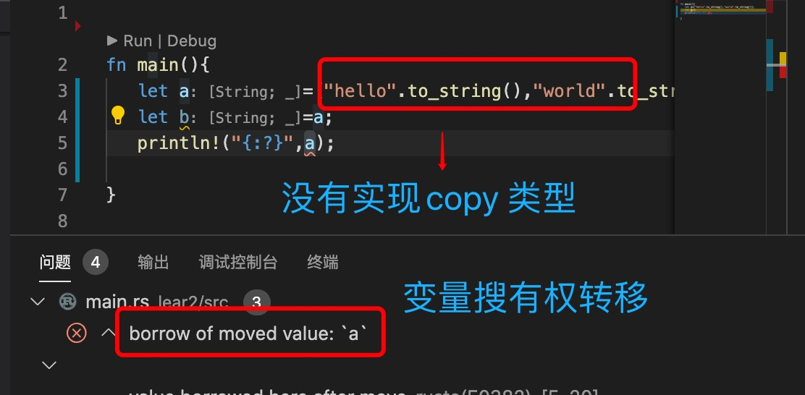

1. 当把一个变量赋值给另一个变量，比如

        let a =12;
        let b=a;

+ 实现了copy 的，比如，int,float,char,&str,bool 

+ 没有实现copy 是转移

   

2. Option 和 数组中所有元素实现了copy ,传递的也是副本

        fn main(){
            let a=[1,2,3,4];
            let b=a;
            println!("{:?}",a);  
        }
    如果是没有实现copy 的，则是转移

    