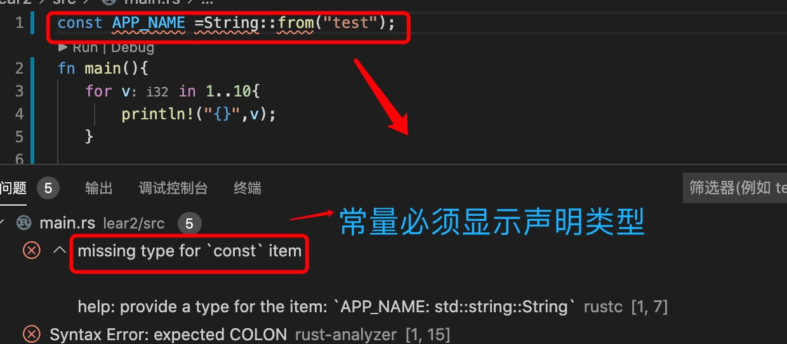
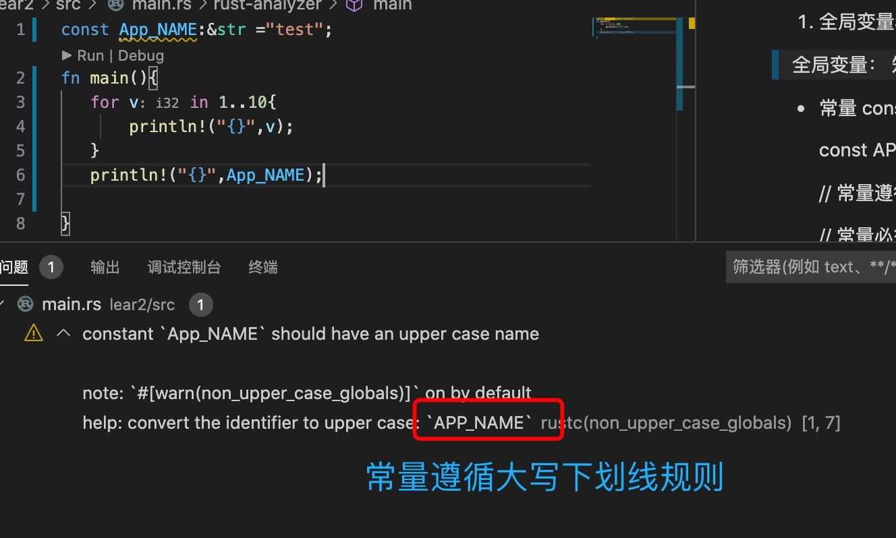
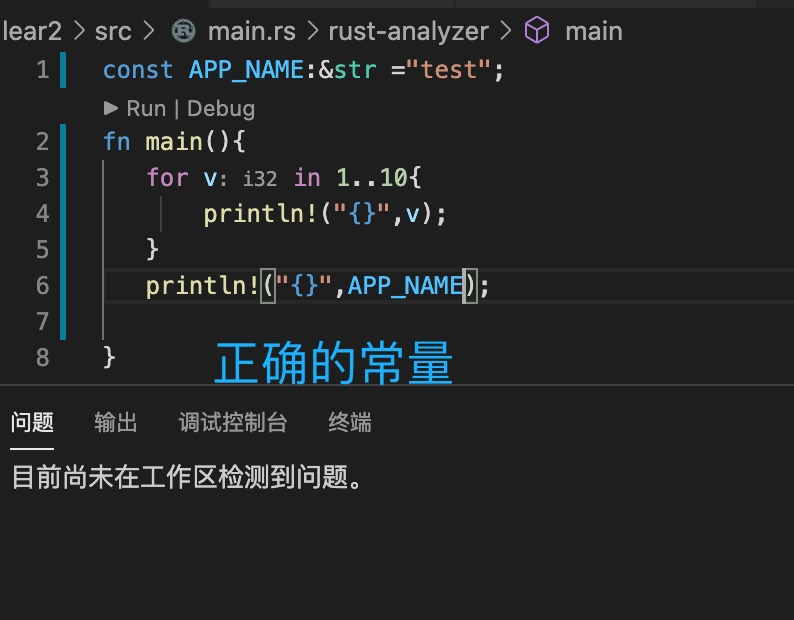
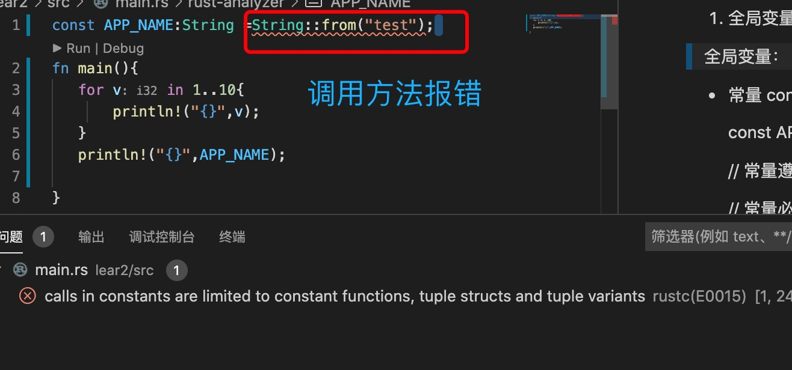

1. 全局变量和局部变量

> 全局变量： 知道应用程序停止才销毁的变量

   + 常量 const 定义，

        const APP_NAME:String=String::from("test");

        // 常量遵循大写下划线规则

        // 常量必须显示声明类型
    
   
   
   
   

> 静态变量 static

2. 局部变量

3. 局部变量作用域 为 {} 花括号