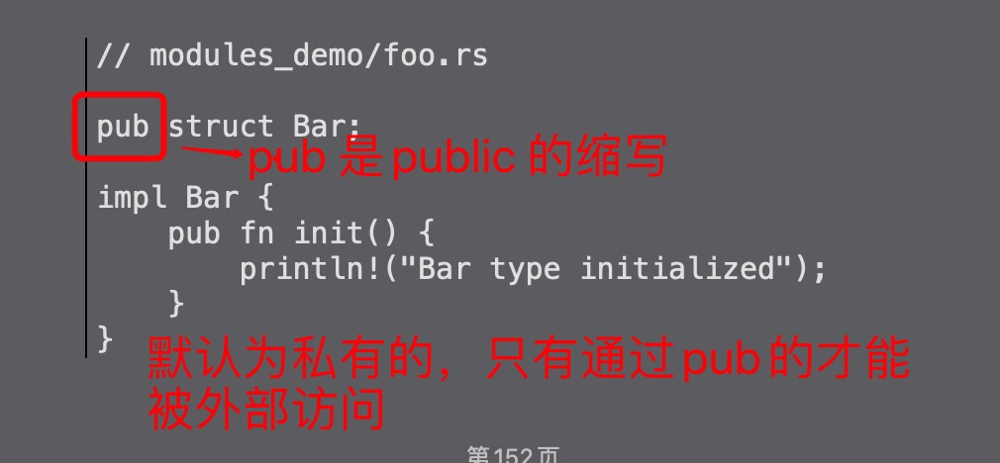
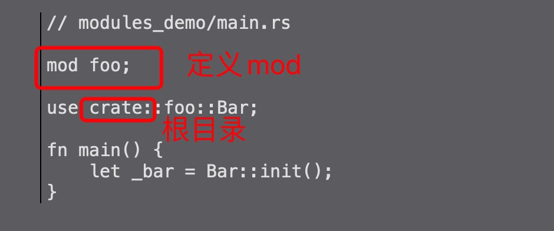

1. 文件作为模块

    

    foo.rs 文件

    

    

2. 三种目录方式

+ crate: 根

   一个绝对的导入前缀，它指向当前crate的根。在前面的代码中，这将是根模块，即main.rs文件。从根模块解析出crate关键字之后的所有内容

+ self: 当前模块

   self：相对导入前缀，是指相对于当前模块的相对项。当任何代码想要引用其包含模块时，例如使用self :: foo :: Bar;时，将使用此方法。当从子模块重新导出项目以从父模块可用时，通常使用此方法

+ super：相对导入前缀，可以使用和导入父模块中的项目。子模块（例如测试模块）将使用它从父模块导入项目。例如，如果模块栏要从其父模块foo访问项目Foo，它将使用super :: foo :: Foo;导入。在模块栏中。
创建模块的第三种方法是将它们组织为目录。