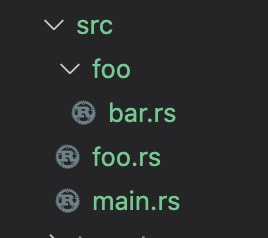
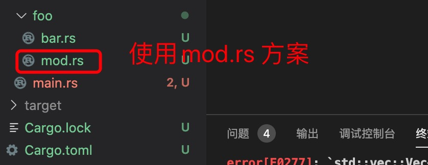

1. rust 2018 支持两种方式定义目录为模块

+ rust 2015 在目录下面定义mod.rs 文件，用来定义模块类型

+ rust 2018 同时支持在目录下创建一个同名的文件来定义模块

2. 项目目录结构

+ rust 2018 同名策略

   

   (1)在bar.rs 定义要公开的数据

            pub struct  Bar;
            impl Bar {
                pub fn hello(){
                    println!("{}","hello from bar");
                }
            }
    (2）在foo.rs 中定义bar 模块

            pub mod bar; // 会自动查找foo/bar.rs 
    (3)在main.rs 中定义foo模块

            mod foo;// 自动查找foo.rs  或者foo 目录

            // 引用bar 模块中的Bar
            use foo::bar::Bar;
            // Bar 在模块bar 的下面，模块bar 在模块foo 的下面

            fn main() {
                Bar::hello();
            }

+ rust2015 mod.rs 策略

   

   第二步改为在mod.rs 中定义模块

        pub mod bar;