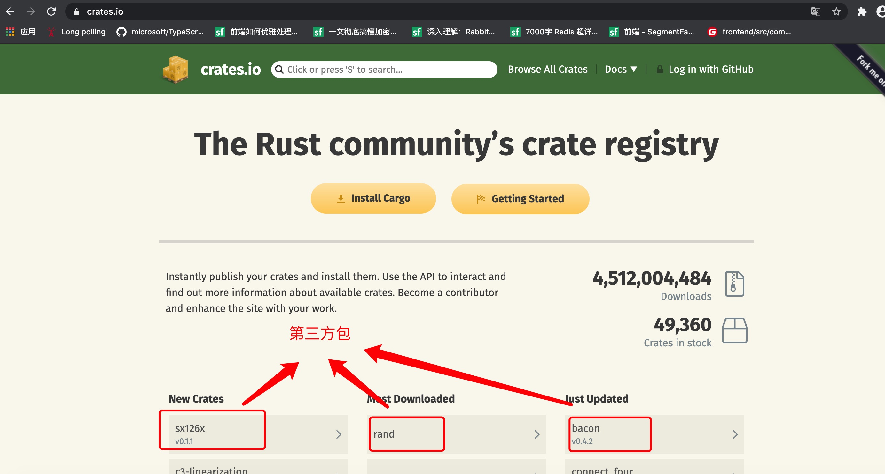

1. 引用包使用use

        use crate::util::modName::test; // 具体的test 方法

        use crate::util::{redis,mysql}; // 只导入redis,mysql

        use crate::util::*;// 导入全部

2. 重名，

+ 不同的方法重名，导入到mod 层次，调用时使用mod::fnName

+ 使用as 重命名，解决冲突

        use std::fmt::Result;
        use std::io::Result as IoResult;

3. 使用第三方包 在crate.io

+ (1) 在Cargo.toml 中的 dependencies 下面添加想依赖的包

        [dependencies]
        linked-list = "0.0.3"

+ (2) 引用,使用extern crate 引入

        extern crate linked-list; // 分号不可以省略
        extern crate regex; // 正则
        use regex::Regex;

4. 包

   每一个包都拥有一个顶级（top-level) 模块src/lib.rs 或 src/main.rs

5. 第三方包管理网站

   