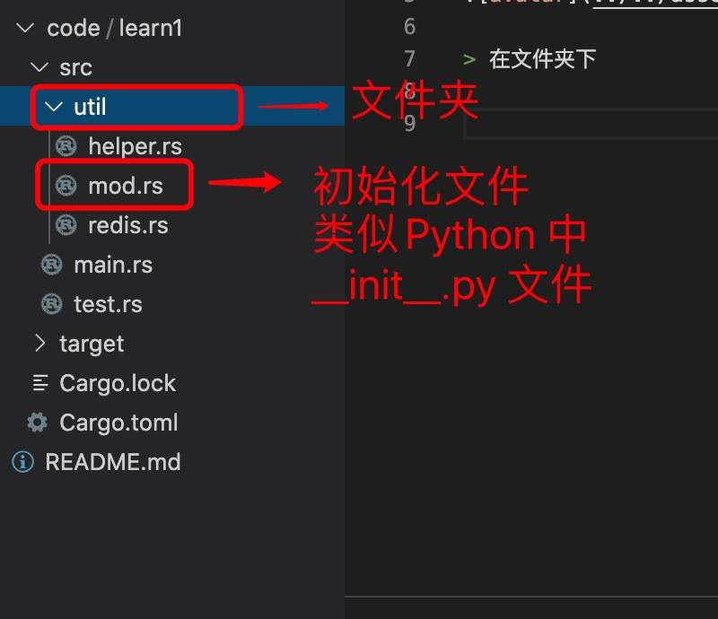

1. 在rust 中每一个.rs 文件都是一个模块

> 和 main.rs 同级别的模块

我们需要在main.rs 中定义模块

    mod test;

在test.rs 中定义模块，方法或者其他等

        pub mod test{
            pub fn test(){
                println!("{}","test");
            }
        }

在main.rs 中使用

        mod test;

        use crate::test::test::{test};

        fn main(){
            test();
            // 或者不使用use
            crate::test::test::test();
        }

>crate::test::test::{test} 路径解析

+ crate ： 是跟路径

+ test: 是main.rs 中定义的模块，

        mod test; // rust编译器会自动查找src/test.rs 文件
+ 第二个test 中test.rs 中定义的test mod

+ 第三个是test 文件中定义的test 方法.

> 可以直接在test 中导出方法

       test.rs

       pub fn test(){
           println!("hello test");
       }

        use crate::test::{test};

> 在文件夹下

当我们定义mod 时，会自动去查找文件或目录

比如：

        mod english;

    这样定义之后,则需要新建一个文件来表示模块内容,可以是english.rs,或者是english/mod.rs

    mod.rs 类似python 中的__init__.py 文件

    在mod.rs 中定义文件会自动查找和模块名称相同的文件

        pub mod redis; // 会自动查找当前目录下redis.rs 文件

> 如果文件夹找还有文件夹，格式和文件夹的一样

