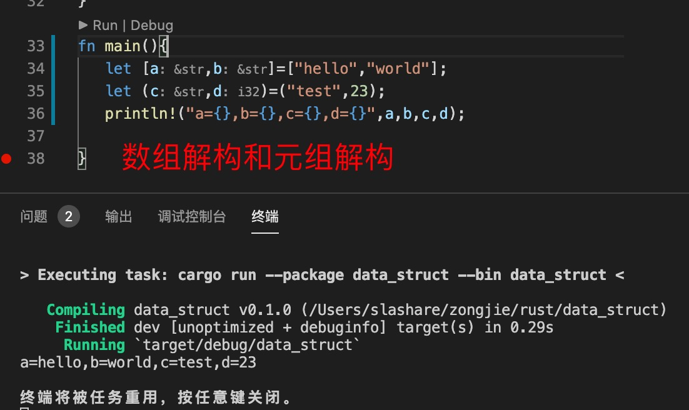
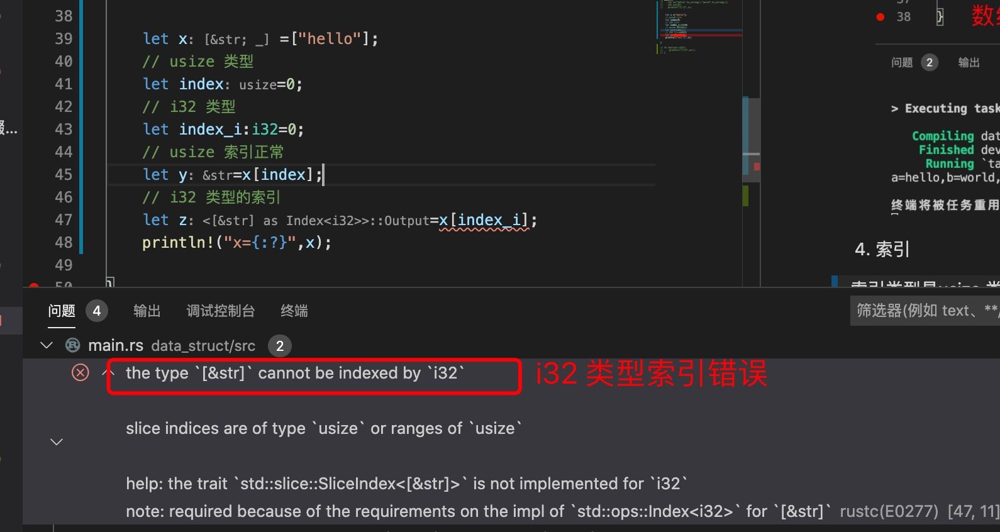
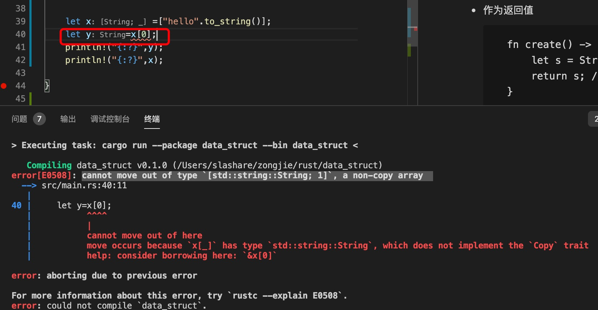
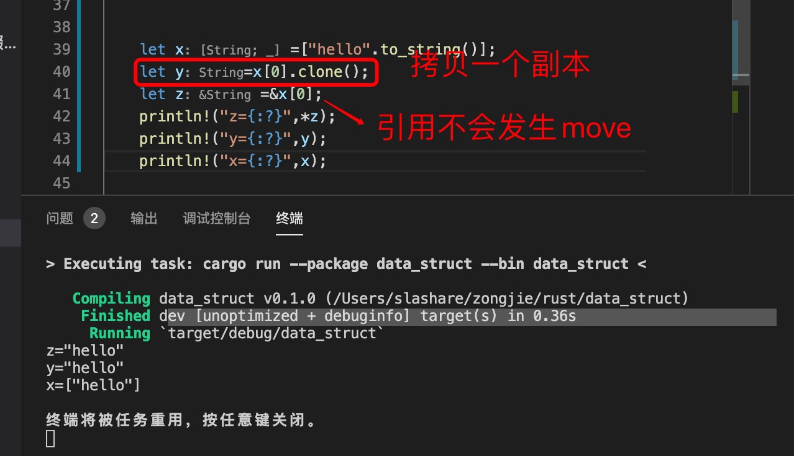

1. rust 这种强类型的数组是同一种类型元素的集合，即每个元素拥有相同的类型，比如 i32 类型的数组，里面每一个元素必须都是i32类型,不然会出现错误.

   

2. rust 中和其他语言的数组不一样，在rust 中***数组的长度是在编译期就确定的***，可以修改数组的元素值，但是不能改变数组的长度，比如增加和减少数组的长度.

3. 数组解构

   

4. 索引

> 索引类型是usize 类型

   

> 当数组元素没有实现Copy ，通过索引获取元素

   

   

   