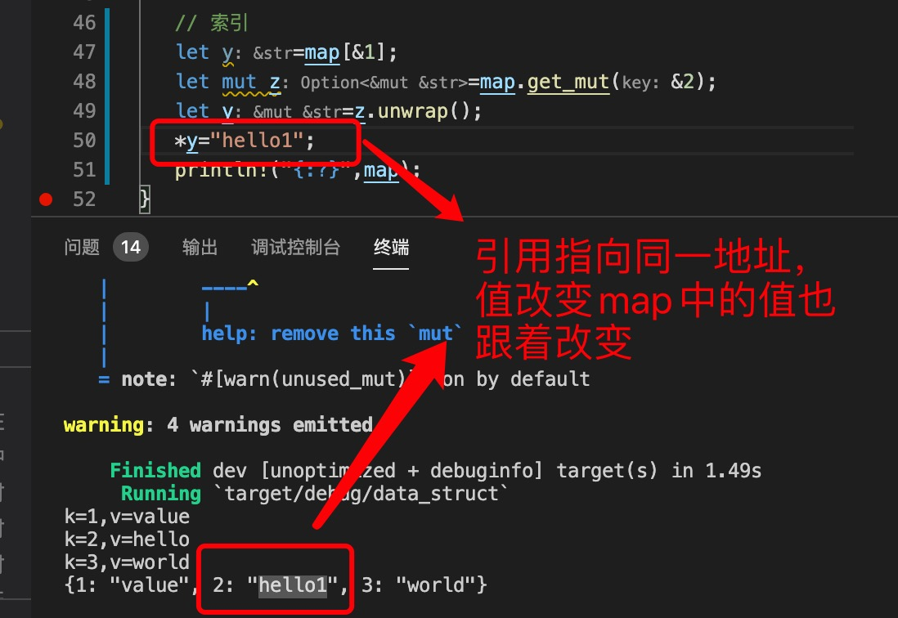

1. HashMap 和 BTreeMap 是通过key/value 的形式存储数据。

       类似于js 中对象： {1:"hello",2:"world"}

2. HashMap 和 BTreeMap 的区别

    >  hashMap key 是无序的，

      

      重新执行

      

    >  BTreeMap key是有序的

      

3. 方法

   引入map

        use std::collections::{HashMap,BTreeMap};

+ new() ：创建空的map

        let mut map =BTreeMap::new();

        let mut map =HashMap::new();

+ insert(key,value): 插入元素

        map.insert(1,"hell0");

+ get(&key): 引用类型，如果是&str,本身就是引用类型，不需要再加&

   

+ [] 索引

   

+ get_mut(&key): value 为可编辑的

   

+ contains_key(&key): 是否存在key

   

+ len(): 返回key 的个数

    

+ is_empty() ： 是否为空，是返回true, 否返回false

   

+ remove(&key): 移除并返回移除的数据

   

+ clear(): 清空

   

+ keys(): 返回map 中所有key

   

+ values(): 返回map 中所有value

   

+ append(&mut Map): 合并map

   

+ extend(iter): 合并map

   

+ iter()  into_iter() iter_mut（） 迭代

4. 循环遍历

    

    

