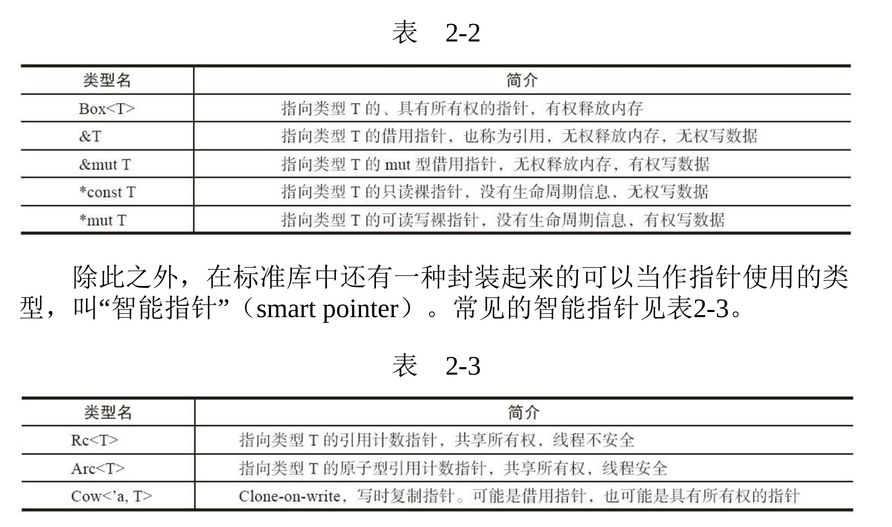

#### 1. 无GC的编程语言， 如C、 C++以及Rust， 对数据的组织操作有更多的自由度， 具体表现为：

+ 同一个类型， 某些时候可以指定它在栈上， 某些时候可以指定它
在堆上。 内存分配方式可以取决于使用方式， 与类型本身无关。

+ 既可以直接访问数据， 也可以通过指针间接访问数据。 可以针对任何一个对象取得指向它的指针。

+ 既可以在复合数据类型中直接嵌入别的类型的实体， 也可以使用
指针， 间接指向别的类型。

+ 甚至可能在复合数据类型末尾嵌入不定长数据构造出不定长的复
合数据类型。
Rust里面也有指针类型

